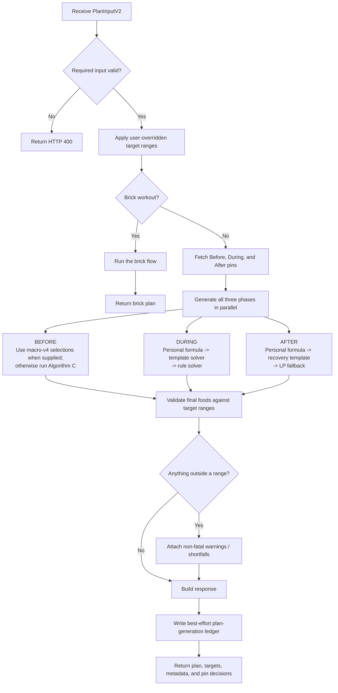
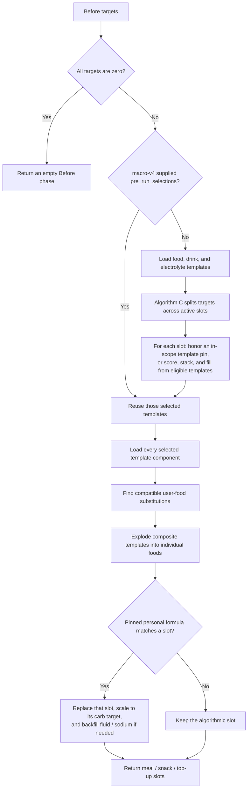
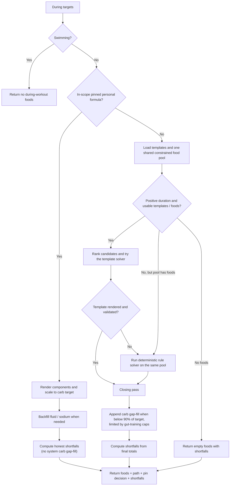
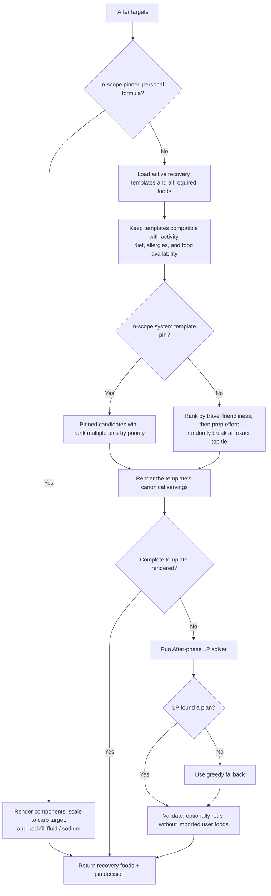
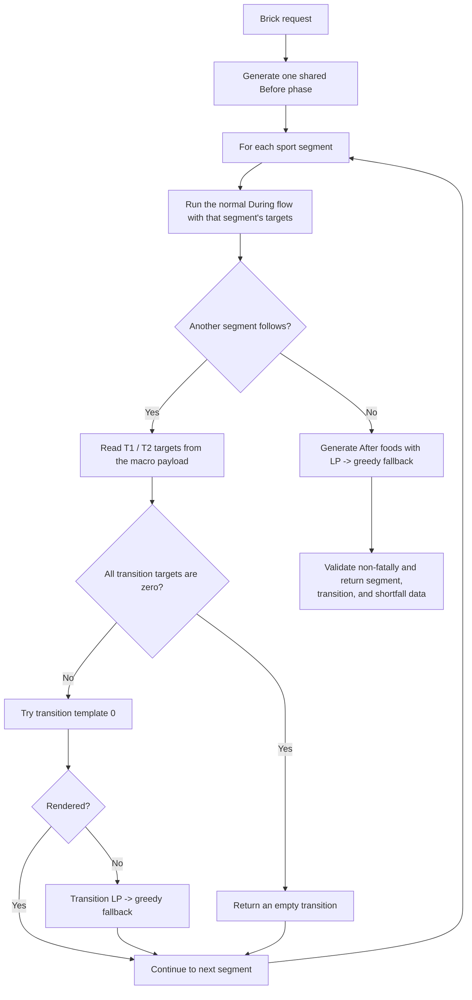

# Generate Nutrition Plan V3: Algorithm Flow

> Current implementation map for `generate-nutrition-plan-v3`, verified against the source on July 21, 2026.

## What this function does

`generate-nutrition-plan-v3` is a **food-selection algorithm**. It does not calculate the athlete's macro targets. The normal app flow is:

```text
generate-macros-v4  ->  macro targets + pre-workout selections
                              |
                              v
generate-nutrition-plan-v3  ->  actual foods for before, during, and after
```

The plan generator consumes:

- target ranges for carbs, protein, sodium, and fluid;
- workout type, duration, and gut-training level;
- diet, allergies, and liked/willing/disliked foods;
- user foods and Formula Kit pins; and
- brick segments and transition targets, when applicable.

## Main flowchart



The three single-sport phases run concurrently. A failure in a phase throws the whole request; a phase that merely misses a target range still returns a plan with warnings or shortfall metadata.

## Before-workout flow



Active slots depend on `hours_before`:

| Time available | Slots produced |
|---|---|
| `>= 2.5 hours` | meal, snack, top-up |
| `>= 1 hour` | snack, top-up |
| `< 1 hour` | top-up |

Important details:

- The live app normally sends `pre_run_selections` already chosen by `generate-macros-v4`. V3's own Algorithm C call is the fallback for a direct call or regeneration without those selections.
- Diet and allergies are hard filters for normal selection. User likes, willingness, and dislikes influence free-form selection. An explicit in-scope pin wins over those filters by design.
- A pinned personal formula overlays only its matching active slot; the other slots stay algorithmic.

## During-workout flow



The key invariant after the July 21 refactor is:

> A During phase cannot leave the generator under target without reporting why in `shortfalls`.

The template solver, rule solver, and carb gap-fill all use the same food pool. There is no During-phase LP fallback and no server-side by-hour scheduling; the server returns `by_hour_data: null` and the client handles placement.

## After-workout flow



The normal recovery-template path deliberately uses the template's authored serving sizes. It does not scale the portion to hit the macro targets. Macro targets are used when scaling a pinned personal formula and by the rare LP fallback.

## Brick-workout branch



Brick-specific differences:

- Formula Kit pins are not currently passed through the brick handler.
- Transition targets come from the macro payload. If they are missing, the safety fallback is zero targets rather than hard-coded duration tiers.
- Brick After uses the LP path directly rather than the normal recovery-template selector.

## Selection precedence and safety rules

1. **Personal formula pin:** highest priority; rendered as authored and scaled to the relevant carb target.
2. **Pinned system template:** wins when it is in scope for the phase, activity, and duration.
3. **System template:** preferred normal path.
4. **Rule solver:** During fallback only.
5. **LP, then greedy:** After fallback, and transition fallback for bricks.

Across the algorithm:

- user-overridden target bands are adjusted before selection;
- normal template pools enforce diet and allergy compatibility;
- pin decisions and skipped-pin reasons are returned for client explanation;
- final range validation is non-fatal; and
- the single-sport response ledger is best-effort and cannot block plan delivery.

## Source map

| Responsibility | Source |
|---|---|
| HTTP orchestration, parallel phases, response, ledger | [`index.ts`](../../supabase/functions/generate-nutrition-plan-v3/index.ts) |
| Before orchestration and personal-formula overlay | [`before-phase.ts`](../../supabase/functions/generate-nutrition-plan-v3/before-phase.ts) |
| Before component expansion | [`before-phase-explosion.ts`](../../supabase/functions/generate-nutrition-plan-v3/before-phase-explosion.ts) |
| Before user-food substitution | [`before-phase-substitution.ts`](../../supabase/functions/generate-nutrition-plan-v3/before-phase-substitution.ts) |
| Algorithm C selection and target splitting | [`pre-workout.ts`](../../supabase/functions/generate-macros-v4/pre-workout.ts) |
| During orchestration and closing-pass invariant | [`during-phase.ts`](../../supabase/functions/generate-nutrition-plan-v3/during-phase.ts) |
| During template solver | [`during-template-solver.ts`](../../supabase/functions/_shared/nutrition/during-template-solver.ts) |
| During rule fallback | [`during-rule-solver.ts`](../../supabase/functions/_shared/nutrition/during-rule-solver.ts) |
| During carb gap-fill | [`during-gap-fill.ts`](../../supabase/functions/_shared/nutrition/during-gap-fill.ts) |
| After orchestration | [`after-phase.ts`](../../supabase/functions/generate-nutrition-plan-v3/after-phase.ts) |
| Recovery-template selection and rendering | [`post-template-solver.ts`](../../supabase/functions/_shared/nutrition/post-template-solver.ts) |
| After LP fallback | [`lp-phase.ts`](../../supabase/functions/generate-nutrition-plan-v3/lp-phase.ts) |
| Brick segments and transitions | [`brick-handler.ts`](../../supabase/functions/generate-nutrition-plan-v3/brick-handler.ts) |
| Non-fatal phase validation | [`validation.ts`](../../supabase/functions/generate-nutrition-plan-v3/validation.ts) |
| Analytics ledger | [`plan-generation-log.ts`](../../supabase/functions/generate-nutrition-plan-v3/plan-generation-log.ts) |
