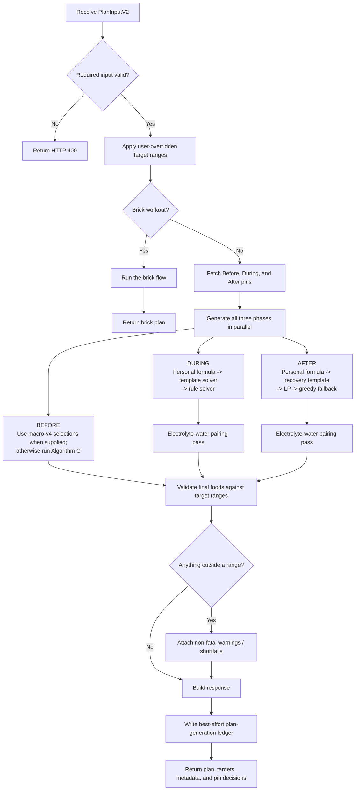
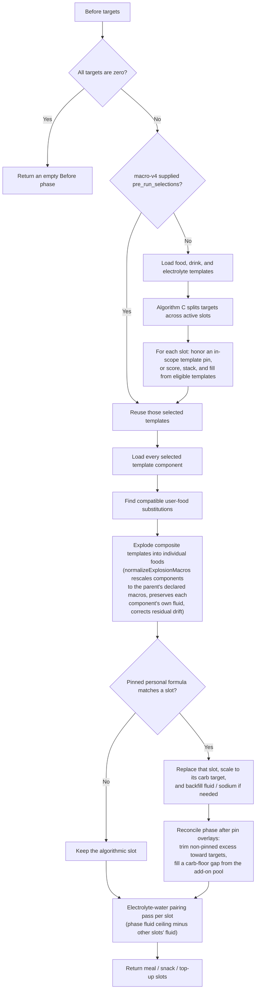
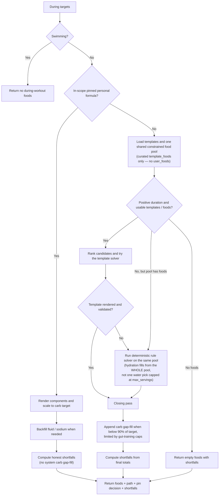
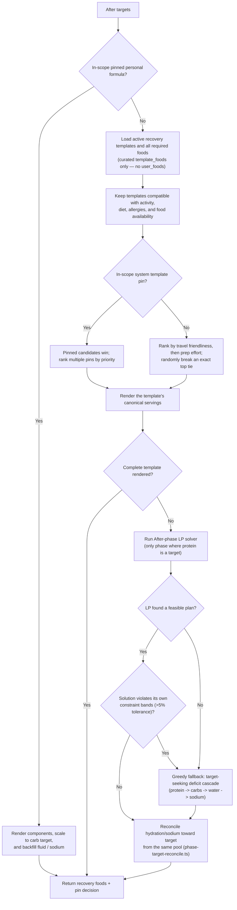
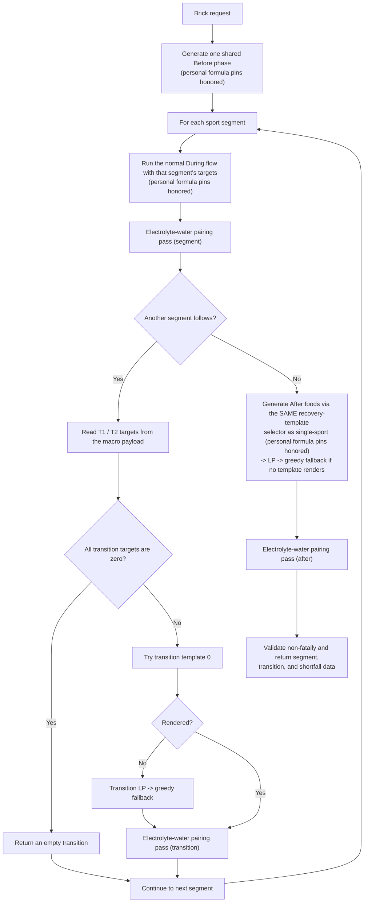

# Generate Nutrition Plan V3: Algorithm Flow

> Current implementation map for `generate-nutrition-plan-v3`, verified against the source on July 29, 2026 (HEAD `f2652750` plus uncommitted same-session changes: food-source policy, electrolyte-water pairing, target-seeking fixes, and post-LP reconciliation). Prior verification: July 21, 2026 — see git history of this file for what changed.

## What this function does

`generate-nutrition-plan-v3` is a **food-selection algorithm**. It does not calculate the athlete's macro targets. The normal app flow is:

```text
generate-macros-v4  ->  macro targets + pre-workout selections
                              |
                              v
generate-nutrition-plan-v3  ->  actual foods for before, during, and after
```

The plan generator consumes:

- target ranges for carbs, sodium, and fluid (protein only in the After phase — see below);
- workout type, duration, and gut-training level;
- diet, allergies, and liked/willing/disliked foods;
- Formula Kit pins (system template pins and personal formula pins); and
- brick segments and transition targets, when applicable.

**Food-source policy (2026-07-29):** every phase's food pool is the curated `template_foods` catalog only. `user_foods` (user-created/barcode-scanned/imported items) is excluded from all plan-generation pools — server after-phase, LP fallback, brick transitions, the client fallback solver, and before-phase substitution all gate on `isClassifiedProductType()` to keep branded/imported items out. Personal formulas (Formula Kit pins) remain the only user-originating content that can appear in a plan.

## Rendered overview

The mermaid diagrams below render in GitHub and most Markdown previews. Each one also has a checked-in static render under `diagrams/` for viewers that can't render mermaid — see **Diagram renders** at the bottom of this file for how to regenerate them.

## Main flowchart



[Full-size render: `diagrams/nutrition-plan-v3-main.svg`](diagrams/nutrition-plan-v3-main.svg) &middot; [PNG](diagrams/nutrition-plan-v3-main.png) — regenerate with the command in **Diagram renders** below.

The three single-sport phases run concurrently. A failure in a phase throws the whole request; a phase that merely misses a target range still returns a plan with warnings or shortfall metadata. The electrolyte-water pairing pass runs on During and After foods at the orchestrator level (`index.ts`), after each phase generator returns and before final range validation; the Before phase applies its own pairing pass internally (see below) because it owns per-slot targets and timing labels that the orchestrator doesn't have.

## Before-workout flow



[Full-size render: `diagrams/nutrition-plan-v3-before.svg`](diagrams/nutrition-plan-v3-before.svg) &middot; [PNG](diagrams/nutrition-plan-v3-before.png) — regenerate with the command in **Diagram renders** below.

Active slots depend on `hours_before`:

| Time available | Slots produced |
|---|---|
| `>= 1.5 hours` | meal, snack, top-up |
| `>= 0.5 hours` | snack, top-up |
| `< 0.5 hours` | top-up |

Important details:

- The live app normally sends `pre_run_selections` already chosen by `generate-macros-v4`. V3's own Algorithm C call is the fallback for a direct call or regeneration without those selections.
- Diet and allergies are hard filters for normal selection. User likes, willingness, and dislikes influence free-form selection. An explicit in-scope pin wins over those filters by design.
- A pinned personal formula overlays only its matching active slot; the other slots stay algorithmic.
- **Post-pin reconciliation** (`reconcileBeforePhaseAfterPins`, `before-phase-reconcile.ts`, wired at `before-phase.ts:414`): Algorithm C sizes the top-up's drink/electrolyte against its own meal + snack. When a personal-formula pin replaces one of those slots, the stale gap-fill can push the whole phase outside every range at once (bug `3abe3fdb754c818c93e8fbbd801dae8e`). This pass trims non-pinned excess toward targets and fills any resulting carb-floor gap from the universal add-on pool. It only runs when at least one slot was pinned.
- **Electrolyte-water pairing** (`electrolyte-water-pairing.ts`, applied per slot at `before-phase.ts:434`): Algorithm C's `pickDrink` and `pickElectrolyte` run independently, so a dry electrolyte item can land in a slot with no drink. This pass guarantees any electrolyte item with negligible fluid of its own (`fluids_ml <= 15ml`) gets paired with a drinkable water item, charged against the phase-level `water_high_ml` ceiling less whatever the other slots already deliver. It never overshoots the ceiling to satisfy the pairing — it fills from headroom, then tries trimming a zero-carb fluid carrier, then reports an honest conflict (`fluid_ceiling` / `no_water_source`) rather than overshooting.

## During-workout flow



[Full-size render: `diagrams/nutrition-plan-v3-during.svg`](diagrams/nutrition-plan-v3-during.svg) &middot; [PNG](diagrams/nutrition-plan-v3-during.png) — regenerate with the command in **Diagram renders** below.

The key invariant, unchanged since the 2026-07-21 refactor, is:

> A During phase cannot leave the generator under target without reporting why in `shortfalls`.

The template solver, rule solver, and carb gap-fill all use the same food pool. There is no During-phase LP fallback and no server-side by-hour scheduling; the server returns `by_hour_data: null` and the client handles placement. Protein is **not** a During-phase input at all — During targets and every During solver work on carbs, sodium, and fluid only (see "Protein scope" below).

**Hydration fix (2026-07-29):** the rule solver used to pick a single water item and cap it at that item's `max_servings`, which could strand total fluid around 86% of target on longer efforts. It now loops over the entire hydration pool (`categorized.hydration` plus liquid extras), filling from successive items until the fluid target is met or the pool is exhausted.

After this diagram's `OUT`, the orchestrator (`index.ts`) runs the electrolyte-water pairing pass on the combined During foods before validation (see Main flowchart).

## After-workout flow



[Full-size render: `diagrams/nutrition-plan-v3-after.svg`](diagrams/nutrition-plan-v3-after.svg) &middot; [PNG](diagrams/nutrition-plan-v3-after.png) — regenerate with the command in **Diagram renders** below.

The normal recovery-template path deliberately uses the template's authored serving sizes. It does not scale the portion to hit the macro targets. Macro targets are used when scaling a pinned personal formula and by the LP/greedy fallback.

**LP rejection (2026-07-29):** `solveLPModel` now rejects a rounded solution that violates its own constraint bands beyond a 5% rounding tolerance and returns `null`, sending the phase to greedy fallback instead of shipping an infeasible plan. This replaced the earlier "validate, optionally retry without imported user foods" step — that retry is gone entirely, because the food pool never contains `user_foods` any more (food-source policy), so there was nothing left to strip.

**Post-LP target reconciliation (`phase-target-reconcile.ts`, new 2026-07-29):** the LP solver is a feasibility engine, not a target-seeking one — its objective maximizes at a vertex of the feasible polytope, so a "successful" solve routinely parks fluid and sodium on a range edge rather than the target. This closing pass runs after **both** the LP and greedy paths (inside `lp-phase.ts`, unconditionally) and tops sodium/fluid up toward the target from the same food pool, adding at most 2 new items, never crossing a band ceiling, and leaving an honest residual gap when item granularity can't close it exactly.

## Protein scope

Protein is **not** a generator input for Before or During. It constrains and scores only:

1. the After-phase LP solver's objective and constraint bands, and
2. the After-phase greedy fallback (`greedy-fallback.ts`), where it leads the deficit cascade (protein → carbs → water → sodium) — the only phase where protein is prioritized first.

The `protein_grams` values you'll see computed inside `before-phase-explosion.ts` are **not** a generator target — they're `normalizeExplosionMacros` rescaling a composite template's own authored component macros to sum to the parent template's declared totals when it explodes into individual foods. That's bookkeeping on an already-selected item's macros, not a solver input.

## Target-seeking standard

Decided 2026-07-29 (Lee): **aim at the target, pass iff inside the range** — not "reach 70-90% of target and stop." This standard now applies across the During/Before greedy fallback, the After greedy fallback, `pickElectrolyte` in Algorithm C, and the After-phase LP reconciliation pass:

- `pickElectrolyte`'s old floor gate (`if (totalSodiumDelivered >= sodiumLow) return null`) is removed. It now scores every candidate against `sodiumTarget` (the midpoint), same as `pickDrink` always has, and only adds a candidate that strictly improves the distance-to-target score without crossing any band ceiling.
- Greedy-fallback and the client greedy solver replaced fixed-fraction stop conditions (90% carbs / 70% protein / 70-85% fluid) with a deficit cascade that keeps filling until each macro is at or past its target, capped by the phase's upper bands.
- `phase-target-reconcile.ts` (After LP path) is a dedicated pass built on this same principle for post-LP results.

## Electrolyte-water pairing invariant

Product rule (Lee, 2026-07-29): **an electrolyte mix, tablet, or sodium supplement must never be recommended on its own — it always goes with water.** Implemented as `_shared/nutrition/electrolyte-water-pairing.ts` (mirrored in Dart at `lib/features/nutrition_plan/application/client_plan/electrolyte_water_pairing.dart` — the two must stay in sync, since the client fallback solver and the edge function must agree on what a valid plan looks like). It's a post-selection pass rather than a per-solver constraint, because fluid is a single pooled target in every solver (LP, rule-based During, greedy fallback, template solvers) — each satisfies "total fluid is inside the band," which is not the same as "this electrolyte item has a drink next to it."

Wired into all seven places a plan can emit an electrolyte item:

- Before phase (per slot, internally — `before-phase.ts`)
- During phase (single-sport — `index.ts`, after `generateDuringPhase` returns)
- After phase (single-sport — `index.ts`, after `generateAfterPhase` returns, regardless of which path produced the foods)
- Brick: each During segment, each T1/T2 transition, and brick After (`brick-handler.ts`)

An item is "unpaired" only when its own fluid is negligible (`fluids_ml <= 15ml`); a drink mix that already carries its fluid is left alone. The pass never overshoots the fluid ceiling to satisfy the pairing — it fills from headroom, then tries trimming a zero-carb fluid carrier already in the plan, then reports an honest `fluid_ceiling`/`no_water_source` conflict.

## Brick-workout branch



[Full-size render: `diagrams/nutrition-plan-v3-brick.svg`](diagrams/nutrition-plan-v3-brick.svg) &middot; [PNG](diagrams/nutrition-plan-v3-brick.png) — regenerate with the command in **Diagram renders** below.

Brick-specific differences (both corrected 2026-07-21, previously undocumented):

- **Formula Kit pins ARE passed through the brick handler** — `userPins.personalFormulas` flows into the shared Before phase, every During segment, and brick After. (An earlier version deferred this, which silently ignored a triathlete's pins across every phase; fixed 2026-07-21.)
- **Brick After uses the same recovery-template selector as single-sport plans** (`generateAfterPhase`, activity type `"running"`), not the LP path directly. It only falls to LP → greedy when no recovery template renders. (Previously brick After used a dedicated LP dose path, which gave brick athletes solver-dosed foods instead of curated recovery templates and ignored their After pins — replaced 2026-07-21.)
- Transition targets come from the macro payload. If they are missing, the safety fallback is zero targets rather than hard-coded duration tiers.

## Selection precedence and safety rules

1. **Personal formula pin:** highest priority; rendered as authored and scaled to the relevant carb target.
2. **Pinned system template:** wins when it is in scope for the phase, activity, and duration.
3. **System template:** preferred normal path.
4. **Rule solver:** During fallback only.
5. **LP, then greedy:** After fallback, and transition fallback for bricks.

Across the algorithm:

- user-overridden target bands are adjusted before selection;
- normal template pools enforce diet and allergy compatibility;
- **the food pool at every stage is the curated `template_foods` catalog only — `user_foods` (user-created / imported / barcode-scanned) never appears in a generated plan; personal formulas are the sole user-originating content** (food-source policy, 2026-07-29);
- **an electrolyte item never ships without a paired drinkable water item**, subject to the phase fluid ceiling (electrolyte-water pairing invariant, 2026-07-29);
- solvers and fallbacks aim at the point target and pass iff inside the range, not at a fixed fraction of it (target-seeking standard, 2026-07-29);
- **protein constrains and scores only the After-phase LP + greedy fallback** — Before and During never consider it;
- pin decisions and skipped-pin reasons are returned for client explanation;
- final range validation is non-fatal; and
- the single-sport response ledger is best-effort and cannot block plan delivery.

## Diagram renders

The mermaid source in this file is the **single source of truth**. The files under `diagrams/` are generated
artifacts — one SVG + one PNG per diagram (`main`, `before`, `during`, `after`, `brick`), each on an explicit
white background so they stay legible in GitHub's dark theme.

**Whenever you edit a mermaid block above, regenerate its render.** Install the CLI once
(`npm i -g @mermaid-js/mermaid-cli`; it pulls a headless Chromium via Puppeteer), then from the repo root:

````bash
# Extract the five mermaid blocks from this doc, then render SVG + PNG for each.
python3 - <<'PY'
import pathlib, re
fence = "`" * 3
doc = pathlib.Path("docs/business_logic/nutrition-plan-v3-algorithm.md").read_text()
blocks = re.findall(fence + r"mermaid\n(.*?)" + fence, doc, re.S)
out = pathlib.Path("docs/business_logic/diagrams"); out.mkdir(exist_ok=True)
for name, body in zip(["main", "before", "during", "after", "brick"], blocks):
    (out / f"nutrition-plan-v3-{name}.mmd").write_text(body)
PY

for n in main before during after brick; do
  mmdc -i docs/business_logic/diagrams/nutrition-plan-v3-$n.mmd \
       -o docs/business_logic/diagrams/nutrition-plan-v3-$n.svg -b white -t default
  mmdc -i docs/business_logic/diagrams/nutrition-plan-v3-$n.mmd \
       -o docs/business_logic/diagrams/nutrition-plan-v3-$n.png -b white -t default -s 2
done
rm docs/business_logic/diagrams/*.mmd
````

Last regenerated 2026-07-29 with mermaid-cli 11.16.0. The old combined `nutrition-plan-v3-flowchart.png` /
`.svg` (2026-07-21) were deleted: a single combined image is how the renders went stale unnoticed, so the
diagrams are now split per phase. The `../../output/pdf/generate-nutrition-plan-v3-flowchart.pdf` link that
used to sit here is also gone — that path never existed in the repo.

## Source map

| Responsibility | Source |
|---|---|
| HTTP orchestration, parallel phases, response, ledger, electrolyte-water pairing (During/After) | [`index.ts`](../../supabase/functions/generate-nutrition-plan-v3/index.ts) |
| Before orchestration, personal-formula overlay, electrolyte-water pairing (per slot) | [`before-phase.ts`](../../supabase/functions/generate-nutrition-plan-v3/before-phase.ts) |
| Before post-pin reconciliation | [`before-phase-reconcile.ts`](../../supabase/functions/generate-nutrition-plan-v3/before-phase-reconcile.ts) |
| Before component expansion + macro normalization | [`before-phase-explosion.ts`](../../supabase/functions/generate-nutrition-plan-v3/before-phase-explosion.ts) |
| Before user-food substitution | [`before-phase-substitution.ts`](../../supabase/functions/generate-nutrition-plan-v3/before-phase-substitution.ts) |
| Algorithm C selection and target splitting; active-slot thresholds | [`pre-workout.ts`](../../supabase/functions/generate-macros-v4/pre-workout.ts) |
| Sub-phase timing labels (mirrors the above thresholds) | [`pre-workout-targets.ts`](../../supabase/functions/_shared/nutrition/templates/pre-workout-targets.ts) |
| During orchestration and closing-pass invariant | [`during-phase.ts`](../../supabase/functions/generate-nutrition-plan-v3/during-phase.ts) |
| During template solver | [`during-template-solver.ts`](../../supabase/functions/_shared/nutrition/during-template-solver.ts) |
| During rule fallback (whole-pool hydration fill) | [`during-rule-solver.ts`](../../supabase/functions/_shared/nutrition/during-rule-solver.ts) |
| During carb gap-fill | [`during-gap-fill.ts`](../../supabase/functions/_shared/nutrition/during-gap-fill.ts) |
| After orchestration | [`after-phase.ts`](../../supabase/functions/generate-nutrition-plan-v3/after-phase.ts) |
| Recovery-template selection and rendering (single-sport AND brick) | [`post-template-solver.ts`](../../supabase/functions/_shared/nutrition/post-template-solver.ts) |
| After LP fallback, LP-rejection, greedy fallback, post-LP reconciliation | [`lp-phase.ts`](../../supabase/functions/generate-nutrition-plan-v3/lp-phase.ts) |
| LP model + solve + constraint-violation rejection | [`lp-solver.ts`](../../supabase/functions/_shared/nutrition/lp-solver.ts) |
| Greedy fallback (target-seeking deficit cascade) | [`greedy-fallback.ts`](../../supabase/functions/_shared/nutrition/greedy-fallback.ts) |
| Post-LP hydration/sodium target reconciliation | [`phase-target-reconcile.ts`](../../supabase/functions/_shared/nutrition/phase-target-reconcile.ts) |
| Electrolyte-water pairing invariant (server) | [`electrolyte-water-pairing.ts`](../../supabase/functions/_shared/nutrition/electrolyte-water-pairing.ts) |
| Electrolyte-water pairing invariant (client mirror) | [`electrolyte_water_pairing.dart`](../../lib/features/nutrition_plan/application/client_plan/electrolyte_water_pairing.dart) |
| Food-source policy (curated-catalog-only pools, `isClassifiedProductType`) | [`template-food-queries.ts`](../../supabase/functions/_shared/nutrition/template-food-queries.ts) |
| Brick segments and transitions | [`brick-handler.ts`](../../supabase/functions/generate-nutrition-plan-v3/brick-handler.ts) |
| Non-fatal phase validation | [`validation.ts`](../../supabase/functions/generate-nutrition-plan-v3/validation.ts) |
| Analytics ledger | [`plan-generation-log.ts`](../../supabase/functions/generate-nutrition-plan-v3/plan-generation-log.ts) |
