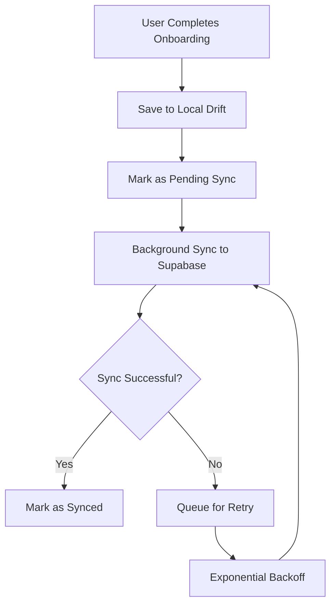
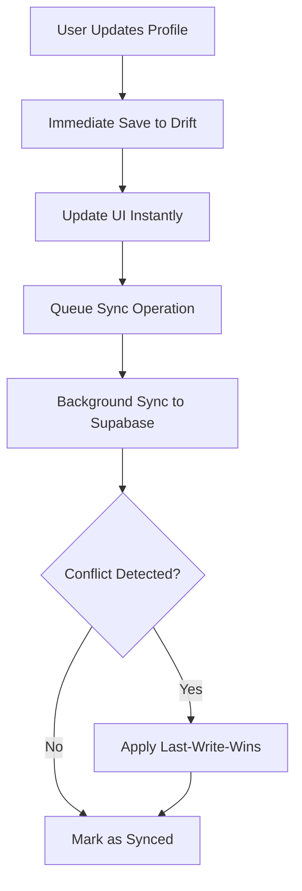
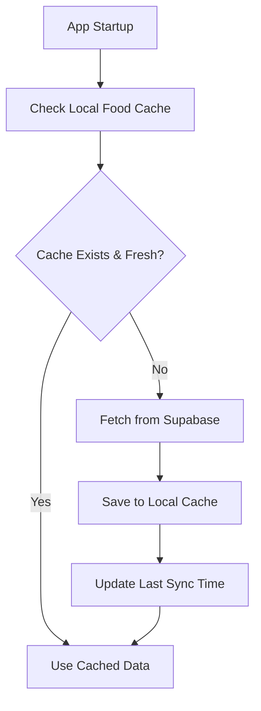
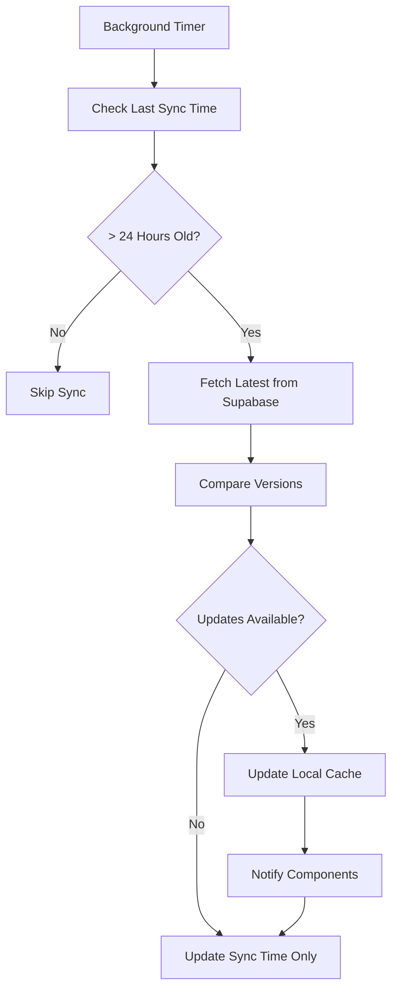
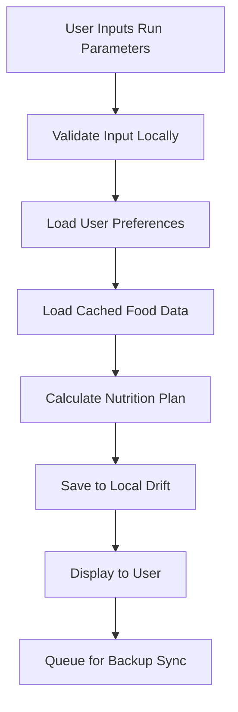
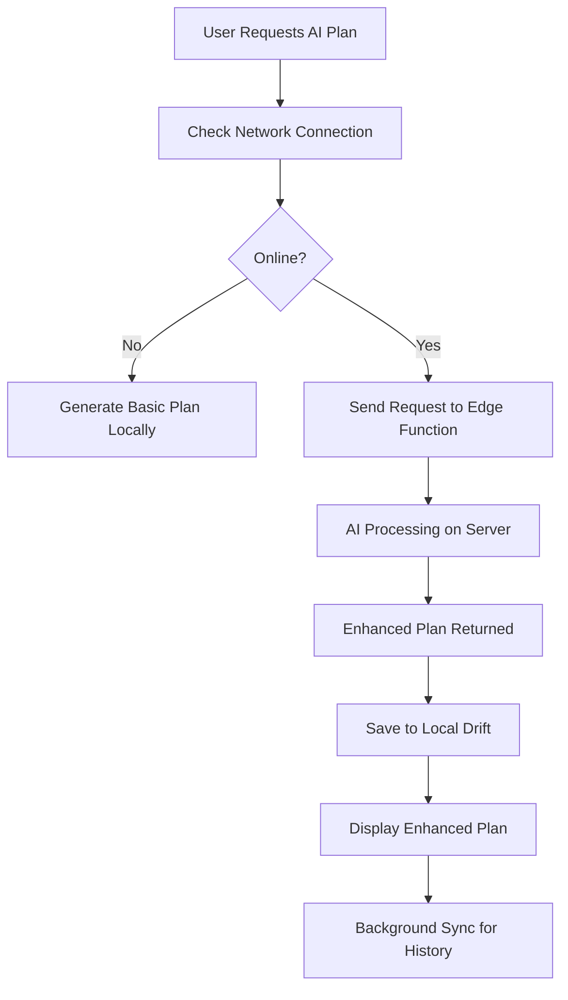
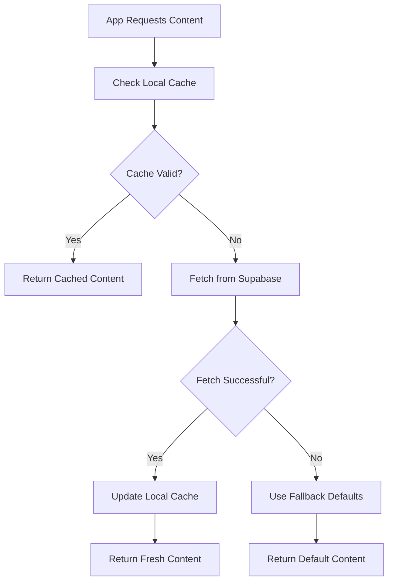
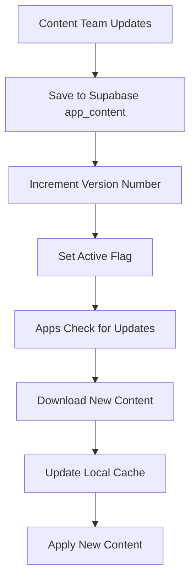
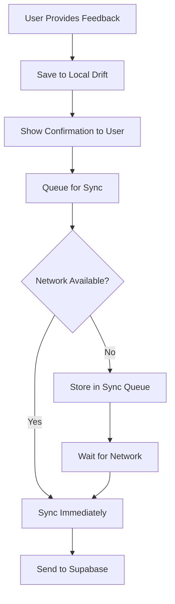
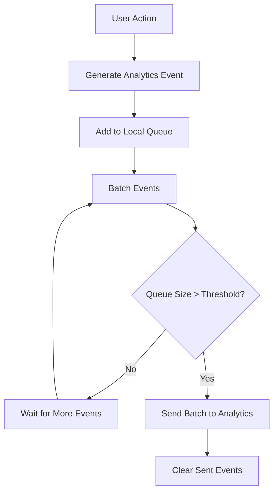

# Data Flow Architecture

## Overview

This document describes how data flows through the Mealvana Endurance system, from user interactions through local storage to backend synchronization. Understanding these flows is essential for maintaining data consistency and system reliability.

## System Components

### Local Layer (Drift SQLite)
- **Primary Storage**: User profiles, preferences, nutrition plans
- **Cache Layer**: Foods, categories, app content
- **Queue Layer**: Pending sync operations, analytics events

### Backend Layer (Supabase PostgreSQL)
- **Master Database**: Authoritative source for shared data
- **Content Management**: Dynamic UI text and algorithm parameters  
- **Analytics Storage**: User feedback and usage metrics
- **Edge Functions**: Server-side business logic

### Sync Layer
- **Background Services**: Periodic data synchronization
- **Conflict Resolution**: Handle concurrent data modifications
- **Retry Logic**: Ensure eventual consistency

## Data Flow Patterns

### 1. User Profile Management

#### Profile Creation Flow


#### Profile Update Flow


### 2. Food Database Management

#### Initial Load Flow


#### Periodic Refresh Flow


### 3. Nutrition Plan Generation

#### Local Plan Creation


#### AI-Enhanced Plan Creation


### 4. Content Management System

#### Content Update Flow


#### Content Deployment Flow


### 5. Analytics and Feedback

#### Feedback Collection Flow


#### Analytics Event Flow


## Sync Coordination

### Startup Sync Sequence
```dart
// In AppStartupService
async initializeApp() {
  1. Initialize Drift database
  2. Run schema migrations if needed
  3. Load cached user profile
  4. Check and refresh content (if stale)
  5. Check and refresh food data (if stale)
  6. Initialize analytics with device context
  7. Start background sync services
}
```

### Background Sync Coordination
```dart
class SyncCoordinator {
  Timer? _syncTimer;
  
  void startPeriodicSync() {
    _syncTimer = Timer.periodic(Duration(hours: 24), (_) async {
      await syncContent();
      await syncFoodDatabase();
      await syncPendingUserData();
    });
  }
}
```

### Network State Management
```dart
class NetworkStateManager {
  void onNetworkAvailable() {
    // Immediately sync high-priority data
    syncPendingFeedback();
    syncPendingPlans();
    
    // Schedule content refresh
    scheduleLowPrioritySync();
  }
  
  void onNetworkUnavailable() {
    // Cancel pending sync operations
    cancelPendingSync();
    
    // Switch to offline mode
    enableOfflineMode();
  }
}
```

## Error Handling Patterns

### Sync Failure Recovery
```dart
class SyncErrorHandler {
  static const maxRetries = 3;
  static const baseDelay = Duration(seconds: 5);
  
  Future<void> handleSyncError(SyncOperation op, Exception error) async {
    if (op.retryCount < maxRetries) {
      // Exponential backoff
      final delay = baseDelay * pow(2, op.retryCount);
      await Future.delayed(delay);
      
      // Retry operation
      op.retryCount++;
      await retrySync(op);
    } else {
      // Max retries reached - log and continue
      logger.error('Sync failed permanently', error: error);
      await markSyncAsFailed(op);
    }
  }
}
```

### Data Consistency Checks
```dart
class DataConsistencyChecker {
  Future<void> validateDataIntegrity() async {
    // Check for orphaned records
    await removeOrphanedFoodPreferences();
    
    // Validate foreign key relationships
    await validatePlanUserReferences();
    
    // Check for data corruption
    await verifyNutritionPlanIntegrity();
  }
}
```

## Performance Optimizations

### Batch Operations
```dart
// Batch multiple operations for efficiency
await database.batch((batch) {
  for (final food in foods) {
    batch.insert(foodsTable, food);
  }
  for (final category in categories) {
    batch.insert(categoriesTable, category);
  }
});
```

### Connection Pooling
```dart
// Single database instance shared across app
class DatabaseProvider {
  static AppDatabase? _instance;
  
  static AppDatabase get instance {
    return _instance ??= AppDatabase();
  }
}
```

### Index Optimization
```sql
-- Optimize common queries
CREATE INDEX idx_nutrition_plans_user_date 
ON nutrition_plans(user_id, created_at DESC);

CREATE INDEX idx_food_preferences_user_food 
ON food_preferences(user_id, food_name);

CREATE INDEX idx_foods_category 
ON food_categories(category_id);
```

## Monitoring and Observability

### Sync Metrics
```dart
class SyncMetrics {
  static void trackSyncOperation(String operation, Duration duration, bool success) {
    analytics.track('sync_operation', {
      'operation': operation,
      'duration_ms': duration.inMilliseconds,
      'success': success,
    });
  }
}
```

### Data Quality Checks
```dart
class DataQualityMonitor {
  Future<void> checkDataQuality() async {
    final stats = await database.getDatabaseStats();
    
    // Alert if data seems corrupted
    if (stats.totalUsers > 0 && stats.totalPreferences == 0) {
      await reportDataInconsistency('missing_preferences');
    }
    
    // Track database growth
    analytics.track('database_stats', stats);
  }
}
```

## Testing Data Flows

### Unit Tests
```dart
test('user profile sync flow', () async {
  // Setup
  final user = createTestUser();
  await database.saveUserProfile(user);
  
  // Test sync
  await syncService.syncUserProfile(user.id);
  
  // Verify
  final syncedUser = await supabase.getUserProfile(user.id);
  expect(syncedUser, equals(user));
});
```

### Integration Tests
```dart
testWidgets('offline plan creation flow', (tester) async {
  // Setup offline environment
  mockNetworkService.setOffline();
  
  // Create plan
  await tester.enterText(find.byKey('distance'), '10');
  await tester.tap(find.text('Generate Plan'));
  await tester.pumpAndSettle();
  
  // Verify plan created locally
  final localPlans = await database.getAllNutritionPlans();
  expect(localPlans, hasLength(1));
});
```

## Data Flow Best Practices

### 1. Always Write Local First
- User actions immediately update local storage
- Background sync handles server updates
- Never block UI on network operations

### 2. Graceful Degradation
- App works fully when offline
- Network features degrade gracefully
- Clear user communication about feature availability

### 3. Eventual Consistency
- Accept that remote sync may be delayed
- Design UI to handle temporary inconsistencies
- Provide manual refresh options when needed

### 4. Data Validation
- Validate data at multiple layers
- Handle server validation errors gracefully
- Preserve user input even if sync fails

### 5. Error Recovery
- Implement robust retry mechanisms
- Provide clear error messages to users
- Maintain data integrity during failures

This data flow architecture ensures reliable, performant data management while providing an excellent user experience both online and offline.