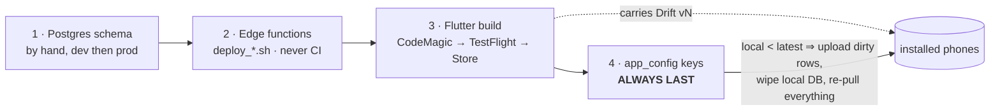
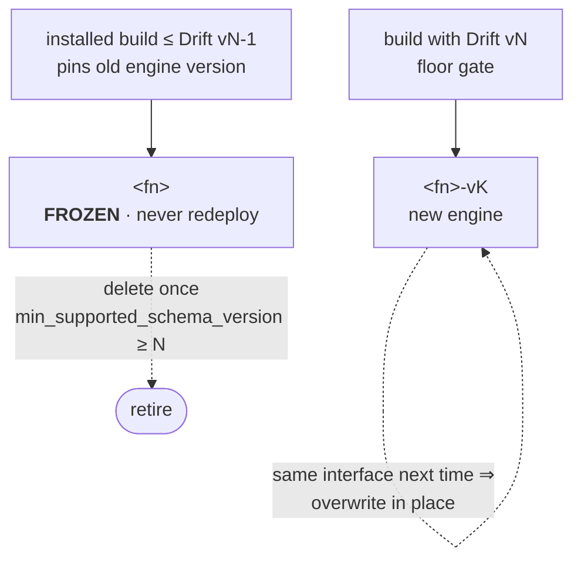

# Supabase deploy playbook — schema, edge functions, app build, and how they move together

**Scope:** the generic, feature-independent rules for shipping a change that touches any of Postgres
schema, edge functions, the Flutter build, or the Drift schema on phones. It says *how things move
and in what order*; it never says *where a particular bundle is*.

- **Live state of a bundle in flight** lives in a per-bundle runbook in the ops repo:
  `../ops/docs/deploys/<date>-<bundle>.md`. Start one from
  [`bundle-runbook-template.md`](bundle-runbook-template.md).
- **Mechanics of record** (scripts, project refs, `/deploy-edge` skill): [`README.md`](README.md)
  (the deployment hub) and `supabase/migrations/README.md`.
- **Evidence:** every rule below was ratified with Lee in the 2026-08-18/19/20 syncs; the verbatim
  quotes and the decision history are preserved in the first runbook,
  `../ops/docs/deploys/2026-08-daily-macros-v6.md`. This file carries the rules, not the transcript.
- **Published copy** (phone-readable, mid-deploy):
  <https://claude.ai/code/artifact/7a8deab2-f5e1-4608-bd81-13a5bba51245>. **This file is canonical** —
  after editing it, republish to *that* URL the same day (publishing without the URL mints a second,
  competing copy; a stale copy once told a reader to redeploy a frozen function).

> **For the coding agent:** read this file top to bottom once (it is short), then the current runbook's
> status header. Precedence when texts disagree: the runbook's dated rulings (newest first) > this file
> > older docs. Volatile facts (current Drift version, current `app_config` values, which functions
> exist) are **never** to be trusted from any doc — read the code / query the project.

---

## 1 · The moving parts

| Asset | Lives in | Runs where | Ships how |
|---|---|---|---|
| **Postgres schema** (tables, enums, RLS) | `supabase/migrations/*.sql` (loose, timestamped, idempotent) and/or `docs/database/apply_all.sql` | Supabase cloud **dev** · **prod** · optional local Docker | SQL applied by hand (DataGrip, or the Management API `database/query`) — dev first, prod at release. `supabase db push` is broken by design (phantom migration rows) — don't. |
| **Edge functions** (TypeScript/Deno) | `supabase/functions/<fn>/` + `_shared/` | Locally (Deno tests; `supabase functions serve`) · deployed to dev · deployed to prod | `./scripts/deploy_dev.sh <fn…>` / `./scripts/deploy_prod.sh <fn…>`. **Never from CI.** |
| **Flutter app** (Dart) | `lib/` | Simulator (dev flavor → always dev cloud) · TestFlight · App Store | CodeMagic build → App Store Connect (see `codemagic.yaml` for which branches auto-build). |
| **Drift schema on the phone** | `lib/shared/database/app_database.dart` (`schemaVersion`) | Every installed device | Bumped in code; **activated by** `app_config` on the server (delete-and-resync). |



**Why the order is the whole point.** The first three ship independently and could go in any order —
it is the fourth, the Drift schema sitting on every phone, that constrains them. `app_config` decides
which installed builds must delete-and-resync, so flipping it *before* the build carrying the new Drift
version is downloadable makes every phone wipe and re-pull on each launch. Set it last, and set it as a
**window** (`min_supported` behind `latest`), not a cliff.

**Dev is the Wild West; prod is ordered.** Break dev freely — no one is using it. Everything below
about ordering and gates is for prod.

---

## 2 · Where a piece of code can execute

**Edge function — three modes**
1. **Local, no Supabase at all** — Deno unit/vector tests: `bash supabase/functions/run-algorithm-tests.sh`
   (auto-discovers every `*.test.ts`). Bulk algorithm testing goes here — no tokens, no cloud calls.
2. **Local function, cloud dev database** — `supabase functions serve <fn>` (or the Deno harness with
   `SUPABASE_URL`/`SUPABASE_ANON_KEY` pointing at dev). Requires dev to already carry any schema the
   function needs (§3). Optional — skip when the value is small.
3. **Deployed to dev (then prod)** — the only mode a simulator / TestFlight build can reach. Remote/E2E
   tests (`run-algorithm-tests.sh --e2e`; filenames `*e2e*`/`*integration*`) hit the deployed endpoint
   and **fail if not deployed** — that is what "integration" means here. Patrol is the same idea with
   the app as the black box.

**Database** — dev cloud (default), prod cloud, or a full local clone via Docker (`supabase start`).
Docker is only for cloning the DB; it is not needed to test edge functions.

**App** — the simulator dev flavor talks to dev cloud, full stop. Pointing a client at a local
function means editing client code and remembering to revert — avoid.

---

## 3 · Ordering rule when BOTH schema and edge function change

**SQL first, always.**

1. Apply the schema to **dev**.
2. (Optional) run the function **locally against dev** (mode 2).
3. **Deploy the function to dev** (`scripts/deploy_dev.sh`).
4. Now the simulator (dev flavor) exercises the whole path; integration tests can go green.
5. Repeat 1→3 against **prod** at release time, with the client-gate ordering in §4 and §7.

Corollaries:
- Integration tests **cannot** be green before step 3 — that is not a bug in the tests. Run them
  locally after the dev deploy; don't wait for CI.
- **Additive migrations** (nullable columns, new enum values, new tables) can be applied whenever you
  like — even on prod — and forgotten about. Only **breaking** schema changes need coordinating with
  a build.

---

## 4 · Schema change — the concrete procedure

1. Write the change as **idempotent SQL** (`CREATE … IF NOT EXISTS`, `DROP … IF EXISTS`, guarded
   `UPDATE`s) in a timestamped file under `supabase/migrations/`. Loose files are allowed; mirroring
   into `docs/database/apply_all.sql` is optional — either convention is fine at this team size.
   Declare any convention the migration relies on (e.g. timestamp columns are naive-local, no timezone)
   in the file header.
2. **Apply to dev** and verify by inspection (`\d <table>`, enum values, RLS on / no policies where
   the table is service-role-only).
3. If the local (Drift) tables change, bump `schemaVersion` in `app_database.dart` **in the same
   branch**, with the matching `onUpgrade` step.
4. **Do NOT touch `app_config` yet** (§7).
5. At release: apply the same SQL to **prod**, ship the build, and only **then** set the `app_config`
   window (§7). On **dev**, set the window immediately after the SQL + function deploy — dev has no
   audience to protect — and tell the other operator so pre-bump develop builds behave.
6. Archive the `.sql` under `supabase/migrations/_archived/` (or mark the `apply_all.sql` section
   "✅ APPLIED to DEV + PROD on <date>").

**Why Drift versions exist.** The phone caches tables; a new build against a changed table would hit
an SQL exception on first open. Drift can migrate in place, but the team deliberately **drops local
data and re-pulls** on a version mismatch (delete-and-resync). Anonymous users have a real auth
account and upload everything first, so the dirty-row upload covers them; the deferred-resync guard is
the backstop.

**Rollback.** Build rollback = previous commit. Schema rollback = reverse the migration file — only
needed for a change that is *not* backward compatible. The real defence is catching it on dev first:
numbers that are wrong on prod were wrong on dev too.

---

## 5 · Edge-function deploy — the concrete procedure

```bash
# from the app repo root, on the branch that carries the change
./scripts/deploy_dev.sh <fn> [<fn>…]
# at release, from trunk (asks for an interactive "yes")
./scripts/deploy_prod.sh <fn> [<fn>…]
```

- The wrappers read the project ref from `.env.dev.local` / `.env.prod.local` and pass
  `--project-ref` explicitly, so a stale `supabase/.temp/project-ref` can't misroute. Never run bare
  `supabase functions deploy`. PAT: `~/.supabase/pat` (a stale env-var export silently 401s).
- **`_shared` changes are bundled at deploy time** — every function that imports the changed module
  must be redeployed. `git diff origin/develop --stat supabase/functions/_shared` tells you the blast
  radius; grep importers to build the deploy list.
- **Frozen functions.** A folder carrying a `FROZEN` marker is a legacy version kept for
  not-yet-updated clients. The wrappers refuse to deploy it without `--force-legacy`; you have no reason
  to pass that flag.
- Verify: `supabase functions list --project-ref <ref>` — the version there is a **deploy counter, not a
  code version**. To audit staleness, `supabase functions download <fn> --project-ref <ref>` and diff.
- Deploying from an **unmerged branch is fine for dev** (deploy = working-tree source). **Prod deploys
  come from trunk after the branch has landed.**
- Superseded tests are retired by **moving them out of the tree** (`_archived/`), not renaming — the
  auto-discovery runner counts everything under `supabase/functions/`. CI does not block on red Deno
  tests, so red ≠ blocked, but red ≠ fine either.
- No cron jobs, DB triggers, or stored procedures call edge functions — by policy (they get lost).
  Check `grep -r "functions/v1/<fn>"` in `lib/` to find every caller before renaming.

---

## 6 · Versioning an edge function — the rule

**"Signature" = the function NAME.** Rename (deploy a new function) when inputs/outputs change **or
when side effects differ** (e.g. the old function writes a table that no longer exists). Same name +
same inputs/outputs + same side effects → **overwrite in place**.

When you must rename:
- Deploy the new name (`<fn>-v<N>`); point the new build at it.
- Leave the old function deployed and **frozen** (`FROZEN` marker, no tests, README) — it serves
  not-yet-updated clients *in perpetuity* until the `min_supported` flip (§7) guarantees no such client
  can run. That flip is the **deletion trigger** for the frozen function.
- Old folders whose clients have all been forced off (`min_supported` ≥ their schema) are removable.

**The client-gate trap.** If the client caches a payload and **discards it on a version mismatch**
(exact-match gate), deploying a new engine version in place makes every installed build loop:
read → discard → recalculate → get the new version → discard again. Two rules follow:
1. Before overwriting a function, check what the client *does* with any version field in the payload.
   Metadata only → overwrite. Discards / branches on it → new function name.
2. Client version gates should be a **floor** (`>=`), not an exact match, and invalidate only on
   schema change. Once that is shipped, future engine bumps with an unchanged interface are plain
   in-place overwrites.



---

## 7 · `app_config` — the last step, as two separate decisions

`VersionCheckService` (`lib/shared/services/version_check_service.dart`) reads these keys at startup:

| key | meaning | effect on a client |
|---|---|---|
| `latest_schema_version` (falls back to `current_schema_version`) | the Drift version the server is on | local **< latest** → **delete-and-resync** on every launch until the gap closes… |
| `min_supported_schema_version` (legacy alias `min_supported_schema`) | the support floor | …**unless** local ≥ min_supported, in which case the client is `ok` (compatibility window). Local **< min_supported** → hard `updateRequired` block over the splash. |
| `min_app_version` | app-version floor | below it → `updateRequired`. Change **in tandem** with `min_supported`, only when you need old clients off. |

Prod carries the full key set; dev's `min_app_version` is not maintained. Always **read the current
values first** — docs about them go stale.

**Step 1 — pointers (safe once the new build is downloadable, not merely approved):**
```sql
update app_config set value = '<N>', updated_at = now()
 where key in ('latest_schema_version', 'current_schema_version');
```
Clients on the previous Drift version stay inside the window → unaffected. Hygiene: `current` should
always equal the shipped Drift version; the app keeps working if you forget (Drift knows its own
version and the client fails safe), but don't forget.

**Step 2 — floor (separate, later, deliberate):**
```sql
update app_config set value = '<N-1 or N>', updated_at = now()
 where key = 'min_supported_schema_version';
```
This **force-updates every athlete below the floor**. Decide the date on adoption data, not on release
day. Nothing about shipping a build requires abandoning older installs the same day. Raising it is
also the moment frozen functions from §6 can be deleted.

**Timing rules**
- "Approved" by App Review ≠ live. Flip nothing until the build is **downloadable** (manual release
  in App Store Connect + storefront propagation).
- **Prod `app_config` writes are a human decision, executed at the operator's explicit direction.**
  The agent prepares the SQL, runs the read-only check, and writes only when told — never as a
  side effect of another task. A wrong value here is an immediate, app-wide lockout.
- Mechanics: DataGrip, the dashboard SQL editor, or the Management API
  (`POST /v1/projects/<ref>/database/query`, PAT from `~/.supabase/pat`). Note that Claude Code's
  auto-mode classifier blocks that API call even for read-only selects — run prod SQL in default
  permission mode.

---

## 8 · The prod sequence (template — instantiate in the runbook)

| # | Step | Gate before next |
|---|---|---|
| P1 | **Schema → prod** (idempotent; additive can go any time) | verified by inspection |
| P2 | **Functions → prod** from trunk (`deploy_prod.sh`, full `_shared` blast radius, never a FROZEN folder) | `functions list` counters bumped |
| P3 | **Integration tests — locally** (`run-algorithm-tests.sh --e2e`, Patrol on-sim). Never on CodeMagic. The self-hosted M1 lane (`tests-selfhosted.yml`) is a free second opinion when online | green |
| P4 | **Merge → `release/*`** — pushing it auto-triggers the CodeMagic release build (billed); no free retries | build in CodeMagic |
| P5 | **Hand smoke-test on TestFlight** — release breaks where dev worked; get it in your hands. Attach IAP consumables on the version page before *Submit for Review* | core + sync paths behave |
| P6 | **Release notes + App Store submit** — written at actual release time from git history since the last release (website + ASC copy, brand-voiced); pasted by hand. Not a `release/*`-triggered automation — many release builds never reach the store | build **downloadable** |
| P7 | **`app_config` step 1** (§7) | no resync loops |
| P8 | Athlete comms if numbers/behaviour visibly shift | — |
| P9 | Cleanup (Backlog): `app_config` step 2 on its own date → delete frozen functions; archive migrations; drop dead Drift upgrade paths | — |

---

## 9 · Standing orders (team policy, not bundle context)

1. **CodeMagic never runs integration/Patrol tests.** It bills real minutes; one develop-push run cost
   ~1h31m. The `integration-tests*` workflows in `codemagic.yaml` stay trigger-disabled (`events: []`).
   Integration tests run locally or on the self-hosted M1 runner. Never add or re-arm a CodeMagic
   workflow without asking.
2. **No hide-flags for dev features.** Dev ships visible and breaks freely.
3. **Never deploy or edit a FROZEN function** without an explicit ruling; the deploy scripts guard it.
4. **Prod deploys happen from trunk, by hand, in the P-sequence.** Never push `release/*` until
   P1–P3 are green.
5. **Edge functions never deploy from CI.** Nothing deploys on merge.
6. **Backups.** Prod has no automatic backups on the current plan (confirmed 2026-08-19; Lee owns the
   fix). Until it exists: commit a schema-only dump after every prod apply as the baseline.
7. **Notion / cut cards.** Run `/release-cut` on every cut (see `CLAUDE.md`).

---

## 10 · Runbooks

| Bundle | Runbook | Status |
|---|---|---|
| daily-macros dashboard v2 + engine v6.0.0 (Drift 17→18, `calculate-daily-macros-v6`) | `../ops/docs/deploys/2026-08-daily-macros-v6.md` | P1–P7 step 1 done 2026-08-27; step 2 open |
| food-recommendation@v1 (Drift 18→19, catalog v1.1 + §10 ledger, v4+v3 in place) | `../ops/docs/deploys/2026-09-food-recommendation.md` | dev half done 2026-09-03; attestation + landing pending; prod not started |

Add a row when you start a runbook; update the status column when it closes.
