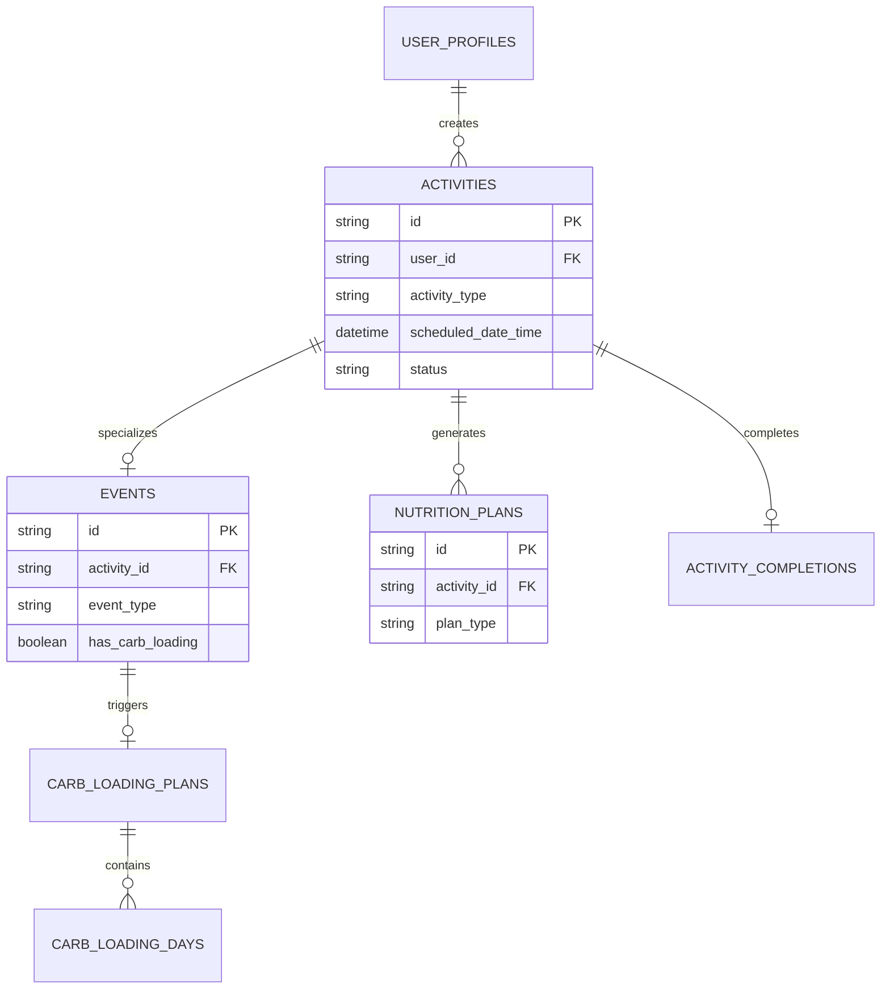

# Calendar Feature Database Schema

## Overview

The Calendar feature extends the existing Mealvana Endurance database schema with new tables and relationships while preserving all current functionality. This document outlines the complete database design, migration strategy, and integration with the existing Drift SQLite and Supabase PostgreSQL dual-database architecture.

## Design Principles

### Data Integrity
- **Referential Integrity**: Proper foreign key relationships between activities, events, and nutrition plans
- **Immutable History**: Past activities and plans cannot be modified, preserving historical accuracy
- **Soft Deletes**: Mark activities as deleted rather than removing data
- **Audit Trail**: Track creation and modification timestamps for all entities

### Performance Optimization
- **Efficient Queries**: Indexes optimized for calendar view queries (date range, user filtering)
- **Scalable Design**: Support for years of activity data without performance degradation
- **Lazy Loading**: Schema supports incremental data loading for large datasets
- **Sync Efficiency**: Minimal data transfer for Supabase synchronization

### Future Extensibility
- **Flexible Activity Types**: Design leaves room to add multi-sport support later without reworking core tables
- **Event Extensibility**: Support for various event types and future enhancements
- **Analytics Support**: Structure enables efficient reporting and trend analysis

## New Tables

### Activities Table

The central table for all calendar entries including workouts and events.

```sql
CREATE TABLE activities (
  id TEXT PRIMARY KEY,
  user_id TEXT NOT NULL,
  activity_type TEXT NOT NULL CHECK (activity_type IN ('running', 'event')),
  title TEXT NOT NULL,
  scheduled_date_time TIMESTAMP NOT NULL,
  status TEXT NOT NULL DEFAULT 'planned' CHECK (status IN ('planned', 'in_progress', 'completed', 'skipped')),

  -- Activity parameters
  distance_miles REAL,
  duration_minutes INTEGER,
  pace_target_minutes_per_mile REAL,
  intensity_level TEXT CHECK (intensity_level IN ('easy', 'moderate', 'hard', 'race')),

  -- Completion data
  completed_at TIMESTAMP,
  completion_rating INTEGER CHECK (completion_rating BETWEEN 1 AND 5),
  completion_notes TEXT,
  actual_distance_miles REAL,
  actual_duration_minutes INTEGER,

  -- Metadata
  notes TEXT,
  created_at TIMESTAMP NOT NULL DEFAULT CURRENT_TIMESTAMP,
  updated_at TIMESTAMP NOT NULL DEFAULT CURRENT_TIMESTAMP,
  deleted_at TIMESTAMP,

  -- Indexes for performance
  INDEX idx_activities_user_date (user_id, scheduled_date_time),
  INDEX idx_activities_status (user_id, status),
  INDEX idx_activities_type (user_id, activity_type)
);
```

**Key Design Decisions**:
- **Unified Model**: Single table for all activity types simplifies queries and relationships
- **Status Tracking**: Explicit status field enables efficient filtering and progress tracking
- **Completion Data**: Separate fields for planned vs. actual metrics enable performance analysis
- **Soft Deletes**: `deleted_at` field preserves data while hiding from normal queries
- **Immutability**: Past activities (completed_at < current_date) are read-only

### Events Table

Specialized data for race events linked to activities.

```sql
CREATE TABLE events (
  id TEXT PRIMARY KEY,
  activity_id TEXT NOT NULL UNIQUE REFERENCES activities(id) ON DELETE CASCADE,

  -- Event classification
  event_type TEXT NOT NULL CHECK (event_type IN ('marathon', 'half_marathon', '10k', '5k', 'ultra_50k', 'ultra_50m', 'ultra_100k', 'ultra_100m', 'custom')),
  event_subtype TEXT, -- For custom categorization

  -- Event details
  event_name TEXT,
  location TEXT,
  registration_url TEXT,
  start_time TIME, -- Separate from activity scheduled_date_time for precise race start

  -- Goals and targets
  goal_time_minutes INTEGER,
  goal_pace_minutes_per_mile REAL,
  predicted_finish_time_minutes INTEGER,

  -- Carb loading configuration
  has_carb_loading BOOLEAN NOT NULL DEFAULT FALSE,
  carb_loading_days INTEGER CHECK (carb_loading_days IN (1, 2, 3, 7)),
  carb_loading_start_date DATE,

  -- Registration and logistics
  bib_number TEXT,
  wave_start_time TIME,
  packet_pickup_info TEXT,

  -- Results (post-event)
  actual_finish_time_minutes INTEGER,
  final_placement INTEGER,
  age_group_placement INTEGER,

  -- Metadata
  created_at TIMESTAMP NOT NULL DEFAULT CURRENT_TIMESTAMP,
  updated_at TIMESTAMP NOT NULL DEFAULT CURRENT_TIMESTAMP,

  INDEX idx_events_activity (activity_id),
  INDEX idx_events_type (event_type),
  INDEX idx_events_date (carb_loading_start_date)
);
```

**Key Design Decisions**:
- **One-to-One Relationship**: Each event links to exactly one activity
- **Event Type Constraints**: Predefined event types ensure data consistency
- **Carb Loading Integration**: Built-in support for carb loading plan configuration
- **Results Tracking**: Fields for post-event performance data
- **Race Logistics**: Support for real-world race management needs

### Carb Loading Plans Table

Manages multi-day carb loading schedules for events.

```sql
CREATE TABLE carb_loading_plans (
  id TEXT PRIMARY KEY,
  event_id TEXT NOT NULL REFERENCES events(id) ON DELETE CASCADE,
  user_id TEXT NOT NULL,

  -- Plan configuration
  total_days INTEGER NOT NULL CHECK (total_days IN (1, 2, 3, 7)),
  start_date DATE NOT NULL,
  end_date DATE NOT NULL,

  -- Daily targets (calculated from user weight and plan duration)
  daily_carb_target_grams INTEGER NOT NULL,
  daily_calorie_target INTEGER,

  -- Plan metadata
  generated_at TIMESTAMP NOT NULL DEFAULT CURRENT_TIMESTAMP,
  algorithm_version TEXT NOT NULL DEFAULT 'v1.0',

  -- Completion tracking
  adherence_score REAL, -- 0.0 to 1.0 based on logged meals
  completed_at TIMESTAMP,

  INDEX idx_carb_loading_event (event_id),
  INDEX idx_carb_loading_user_date (user_id, start_date),
  UNIQUE(event_id) -- One carb loading plan per event
);
```

### Carb Loading Days Table

Individual day entries within a carb loading plan.

```sql
CREATE TABLE carb_loading_days (
  id TEXT PRIMARY KEY,
  carb_loading_plan_id TEXT NOT NULL REFERENCES carb_loading_plans(id) ON DELETE CASCADE,

  -- Day information
  plan_date DATE NOT NULL,
  day_number INTEGER NOT NULL, -- 1, 2, 3, etc. (1 = first day, last number = race day - 1)

  -- Daily targets
  carb_target_grams INTEGER NOT NULL,
  carb_protocol_g_per_kg REAL NOT NULL, -- Carbohydrate protocol (e.g., 8.0 for 8g/kg bodyweight) - enables UI to display "8g/kg bodyweight"
  calorie_target INTEGER,
  meal_count INTEGER DEFAULT 6, -- breakfast, snack, lunch, snack, dinner, evening

  -- Meal distribution (percentages that sum to 1.0)
  breakfast_percent REAL DEFAULT 0.25,
  morning_snack_percent REAL DEFAULT 0.10,
  lunch_percent REAL DEFAULT 0.25,
  afternoon_snack_percent REAL DEFAULT 0.15,
  dinner_percent REAL DEFAULT 0.20,
  evening_snack_percent REAL DEFAULT 0.05,

  -- Progress tracking
  logged_carbs_grams INTEGER DEFAULT 0,
  logged_calories INTEGER DEFAULT 0,
  completed BOOLEAN DEFAULT FALSE,

  INDEX idx_carb_days_plan_date (carb_loading_plan_id, plan_date),
  UNIQUE(carb_loading_plan_id, plan_date)
);
```

**Recent Changes (October 2025)**:
- Added `carb_protocol_g_per_kg` field to store the carbohydrate protocol formula
- Purpose: Enables UI to display contextual information like "8g/kg bodyweight (610g total)" instead of just "610g"
- Benefits user understanding of why their target is what it is

### Activity Completions Table

Detailed completion data with voice notes and ratings.

```sql
CREATE TABLE activity_completions (
  id TEXT PRIMARY KEY,
  activity_id TEXT NOT NULL UNIQUE REFERENCES activities(id) ON DELETE CASCADE,
  user_id TEXT NOT NULL,

  -- Completion details
  completed_at TIMESTAMP NOT NULL,
  completion_type TEXT NOT NULL DEFAULT 'manual' CHECK (completion_type IN ('manual', 'automatic', 'imported')),

  -- Performance data
  actual_distance_miles REAL,
  actual_duration_minutes INTEGER,
  average_pace_minutes_per_mile REAL,
  max_heart_rate INTEGER,
  average_heart_rate INTEGER,
  calories_burned INTEGER,

  -- User feedback
  effort_rating INTEGER CHECK (effort_rating BETWEEN 1 AND 5), -- How hard was the workout
  nutrition_rating INTEGER CHECK (nutrition_rating BETWEEN 1 AND 5), -- How well did nutrition work
  overall_satisfaction INTEGER CHECK (overall_satisfaction BETWEEN 1 AND 5), -- Overall experience

  -- Notes and feedback
  text_notes TEXT,
  voice_note_id TEXT, -- References existing voice note entry when available
  has_voice_recording BOOLEAN DEFAULT FALSE,

  -- Conditions
  weather_conditions TEXT,
  temperature_fahrenheit INTEGER,
  humidity_percent INTEGER,

  -- Analysis (populated by background processing)
  nutrition_adherence_score REAL, -- 0.0 to 1.0 based on plan execution
  performance_vs_target REAL, -- Actual performance vs. planned

  INDEX idx_completions_activity (activity_id),
  INDEX idx_completions_user_date (user_id, completed_at),
  INDEX idx_completions_ratings (user_id, nutrition_rating, overall_satisfaction)
);
```

## Modified Tables

### Nutrition Plans Table Extensions

Extend existing `nutrition_plans` table to link with activities:

```sql
-- Add new columns to existing nutrition_plans table
ALTER TABLE nutrition_plans ADD COLUMN activity_id TEXT REFERENCES activities(id);
ALTER TABLE nutrition_plans ADD COLUMN plan_type TEXT DEFAULT 'standard' CHECK (plan_type IN ('standard', 'carb_loading', 'recovery'));
ALTER TABLE nutrition_plans ADD COLUMN sport_type TEXT DEFAULT 'running'; -- Placeholder for future multi-sport support

-- Add indexes for new relationships
CREATE INDEX idx_nutrition_plans_activity ON nutrition_plans(activity_id);
CREATE INDEX idx_nutrition_plans_type ON nutrition_plans(plan_type);
```

**Migration Strategy**:
- Add new columns with default values to preserve existing data
- Backfill existing plans with `plan_type = 'standard'` and `sport_type = 'running'`
- Create activities for existing plans where appropriate

### User Profiles Table Extensions

Add calendar preferences to existing `user_profiles` table:

```sql
-- Add calendar-specific preferences
ALTER TABLE user_profiles ADD COLUMN calendar_week_start TEXT DEFAULT 'monday' CHECK (calendar_week_start IN ('sunday', 'monday'));
ALTER TABLE user_profiles ADD COLUMN default_activity_time TIME DEFAULT '07:00:00';
ALTER TABLE user_profiles ADD COLUMN default_activity_day TEXT DEFAULT 'saturday' CHECK (default_activity_day IN ('monday', 'tuesday', 'wednesday', 'thursday', 'friday', 'saturday', 'sunday'));
ALTER TABLE user_profiles ADD COLUMN auto_generate_nutrition BOOLEAN DEFAULT TRUE;
ALTER TABLE user_profiles ADD COLUMN completion_reminders BOOLEAN DEFAULT TRUE;
```

## Relationships and Constraints

### Primary Relationships



### Data Integrity Rules

1. **Activity Immutability**: Activities with `completed_at` in the past cannot be modified
2. **Event Uniqueness**: Each activity can have at most one associated event
3. **Carb Loading Constraints**: Only events can have carb loading plans
4. **Completion Uniqueness**: Each activity can have at most one completion record
5. **Date Validation**: Activity dates cannot be more than 2 years in the future
6. **User Isolation**: All entities must belong to the authenticated user

### Cascade Behaviors

- **Activity Deletion**: Soft delete (set `deleted_at`) cascades to related entities
- **User Deletion**: Hard delete cascades to all user data
- **Event Deletion**: Cascades to carb loading plans and days
- **Plan Deletion**: Updates activity reference to null (orphaned nutrition plans preserved)

## Migration Strategy

### Phase 1: Schema Creation (Week 1)

```sql
-- Migration 001: Create new tables
-- File: lib/shared/database/migrations/001_create_calendar_tables.dart

class Migration001CreateCalendarTables extends Migration {
  @override
  void up() {
    // Create activities table
    create.table('activities')
      .withColumn('id', ColumnType.text().primaryKey())
      .withColumn('user_id', ColumnType.text().notNull())
      // ... full table definition
      ;

    // Create events table
    create.table('events')
      .withColumn('id', ColumnType.text().primaryKey())
      .withColumn('activity_id', ColumnType.text().notNull().references('activities', 'id'))
      // ... full table definition
      ;

    // Additional tables...
  }

  @override
  void down() {
    drop.table('carb_loading_days');
    drop.table('carb_loading_plans');
    drop.table('activity_completions');
    drop.table('events');
    drop.table('activities');
  }
}
```

### Phase 2: Existing Table Extensions (Week 2)

```sql
-- Migration 002: Extend existing tables
-- File: lib/shared/database/migrations/002_extend_existing_tables.dart

class Migration002ExtendExistingTables extends Migration {
  @override
  void up() {
    // Extend nutrition_plans table
    alter.table('nutrition_plans')
      .addColumn('activity_id', ColumnType.text().nullable().references('activities', 'id'))
      .addColumn('plan_type', ColumnType.text().withDefault('standard'))
      .addColumn('sport_type', ColumnType.text().withDefault('running'));

    // Extend user_profiles table
    alter.table('user_profiles')
      .addColumn('calendar_week_start', ColumnType.text().withDefault('monday'))
      .addColumn('default_activity_time', ColumnType.time().withDefault('07:00:00'))
      .addColumn('default_activity_day', ColumnType.text().withDefault('saturday'))
      .addColumn('auto_generate_nutrition', ColumnType.boolean().withDefault(true))
      .addColumn('completion_reminders', ColumnType.boolean().withDefault(true));
  }

  @override
  void down() {
    // Remove added columns in reverse order
    alter.table('user_profiles')
      .dropColumn('completion_reminders')
      .dropColumn('auto_generate_nutrition')
      .dropColumn('default_activity_day')
      .dropColumn('default_activity_time')
      .dropColumn('calendar_week_start');

    alter.table('nutrition_plans')
      .dropColumn('sport_type')
      .dropColumn('plan_type')
      .dropColumn('activity_id');
  }
}
```

### Phase 3: Data Migration (Week 3)

```sql
-- Migration 003: Migrate existing data
-- File: lib/shared/database/migrations/003_migrate_existing_data.dart

class Migration003MigrateExistingData extends Migration {
  @override
  void up() {
    // Create activities for existing nutrition plans
    custom('''
      INSERT INTO activities (id, user_id, activity_type, title, scheduled_date_time, status)
      SELECT
        'act_' || np.id,
        np.user_id,
        'running',
        'Imported Run - ' || DATE(np.created_at),
        COALESCE(np.run_date_time, np.created_at + interval '1 day'),
        CASE
          WHEN np.plan_rating IS NOT NULL THEN 'completed'
          ELSE 'planned'
        END
      FROM nutrition_plans np
      WHERE np.activity_id IS NULL;
    ''');

    // Update nutrition plans with activity references
    custom('''
      UPDATE nutrition_plans
      SET activity_id = 'act_' || id
      WHERE activity_id IS NULL;
    ''');

    // Create completion records for rated plans
    custom('''
      INSERT INTO activity_completions (id, activity_id, user_id, completed_at, nutrition_rating, text_notes)
      SELECT
        'comp_' || np.id,
        np.activity_id,
        np.user_id,
        np.run_date_time,
        np.plan_rating,
        np.journal_notes
      FROM nutrition_plans np
      WHERE np.plan_rating IS NOT NULL AND np.run_date_time IS NOT NULL;
    ''');
  }

  @override
  void down() {
    // Remove migrated data
    delete.from('activity_completions').where('id LIKE "comp_%"');
    delete.from('activities').where('id LIKE "act_%"');
    update.table('nutrition_plans').set('activity_id', null);
  }
}
```

### Supabase Migration

Parallel migration for Supabase PostgreSQL:

```sql
-- File: supabase/migrations/001_calendar_feature.sql

-- Create new tables (same structure as Drift)
CREATE TABLE activities (
  id TEXT PRIMARY KEY,
  user_id UUID NOT NULL REFERENCES auth.users(id) ON DELETE CASCADE,
  activity_type TEXT NOT NULL CHECK (activity_type IN ('running', 'event')),
  -- ... rest of table definition
);

-- Enable Row Level Security
ALTER TABLE activities ENABLE ROW LEVEL SECURITY;
CREATE POLICY "Users can manage their own activities" ON activities
  FOR ALL USING (auth.uid() = user_id);

-- Create additional tables with RLS policies...

-- Update existing tables
ALTER TABLE nutrition_plans ADD COLUMN activity_id TEXT;
ALTER TABLE nutrition_plans ADD COLUMN plan_type TEXT DEFAULT 'standard';
ALTER TABLE nutrition_plans ADD COLUMN sport_type TEXT DEFAULT 'running';
```

## Performance Optimization

### Indexes

**Calendar View Optimization**:
```sql
-- Optimized for loading calendar week view
CREATE INDEX idx_activities_calendar_view ON activities(user_id, scheduled_date_time, status)
WHERE deleted_at IS NULL;

-- Optimized for activity completion queries
CREATE INDEX idx_activities_pending_completion ON activities(user_id, scheduled_date_time, status)
WHERE status = 'planned' AND scheduled_date_time < CURRENT_TIMESTAMP;
```

**Carb Loading Queries**:
```sql
-- Optimized for carb loading plan lookup
CREATE INDEX idx_carb_loading_active_plans ON carb_loading_plans(user_id, start_date, end_date)
WHERE completed_at IS NULL;

-- Optimized for daily carb loading progress
CREATE INDEX idx_carb_days_progress ON carb_loading_days(carb_loading_plan_id, plan_date, completed);
```

**Analytics and Reporting**:
```sql
-- Optimized for completion trend analysis
CREATE INDEX idx_completions_analytics ON activity_completions(user_id, completed_at, nutrition_rating, overall_satisfaction);

-- Optimized for performance correlation queries
CREATE INDEX idx_activities_performance ON activities(user_id, activity_type, completed_at)
WHERE status = 'completed';
```

### Query Patterns

**Calendar Week Load** (most frequent query):
```sql
SELECT a.*, e.event_type, e.has_carb_loading, np.id as nutrition_plan_id
FROM activities a
LEFT JOIN events e ON a.id = e.activity_id
LEFT JOIN nutrition_plans np ON a.id = np.activity_id
WHERE a.user_id = ?
  AND a.scheduled_date_time BETWEEN ? AND ?
  AND a.deleted_at IS NULL
ORDER BY a.scheduled_date_time;
```

**Pending Completions Check** (app startup):
```sql
SELECT a.*, np.id as nutrition_plan_id
FROM activities a
LEFT JOIN nutrition_plans np ON a.id = np.activity_id
WHERE a.user_id = ?
  AND a.status = 'planned'
  AND a.scheduled_date_time < CURRENT_TIMESTAMP
  AND a.deleted_at IS NULL
ORDER BY a.scheduled_date_time DESC
LIMIT 1;
```

## Data Validation Rules

### Business Logic Constraints

1. **Activity Scheduling**:
   - Activities cannot be scheduled more than 2 years in future
   - Past activities (completed_at < now) are immutable
   - Activity status must progress logically (planned → in_progress → completed/skipped)

2. **Event Management**:
   - Events must have activity_type = 'event'
   - Carb loading plans only valid for events
   - Event dates must align with activity scheduled_date_time

3. **Completion Rules**:
   - Only planned or in_progress activities can be completed
   - Completion timestamp must be after scheduled_date_time
   - Ratings must be between 1 and 5

4. **Carb Loading Logic**:
   - Start date must be 1-7 days before event date
   - End date must be day before event
   - Daily targets must be positive integers
   - Meal percentages must sum to approximately 1.0

### Data Type Validation

```dart
// Example validation in Dart domain models
class Activity {
  final String id;
  final String userId;
  final ActivityType activityType;
  final DateTime scheduledDateTime;
  final ActivityStatus status;

  // Business rule validation
  bool get isImmutable =>
    status == ActivityStatus.completed &&
    scheduledDateTime.isBefore(DateTime.now().subtract(Duration(days: 1)));

  bool get canBeCompleted =>
    (status == ActivityStatus.planned || status == ActivityStatus.inProgress) &&
    scheduledDateTime.isBefore(DateTime.now().add(Duration(hours: 12)));
}
```

## Sync and Conflict Resolution

### Sync Strategy

**Local-First Approach**:
1. All operations occur on local Drift database first
2. Changes queued for background sync to Supabase
3. Conflict resolution favors local changes for user experience
4. Failed syncs retry with exponential backoff

**Conflict Resolution Rules**:
- **User Data**: Last write wins (local changes take precedence)
- **System Data**: Server authoritative (content management, algorithm parameters)
- **Completion Data**: Local wins (user feedback is authoritative)
- **Plan Generation**: Re-generate on conflict rather than merge

### Sync Implementation

```dart
class CalendarSyncService {
  Future<void> syncActivities() async {
    // 1. Upload local changes
    final localChanges = await _getUnsyncedActivities();
    await _uploadToSupabase(localChanges);

    // 2. Download remote changes
    final remoteChanges = await _getRemoteActivitiesSince(lastSyncTime);
    await _mergeRemoteChanges(remoteChanges);

    // 3. Update sync timestamp
    await _updateLastSyncTime();
  }

  Future<void> _mergeRemoteChanges(List<Activity> remoteActivities) async {
    for (final remoteActivity in remoteActivities) {
      final localActivity = await _getLocalActivity(remoteActivity.id);

      if (localActivity == null) {
        // New remote activity - add locally
        await _insertLocalActivity(remoteActivity);
      } else if (localActivity.updatedAt.isBefore(remoteActivity.updatedAt)) {
        // Remote is newer - check for conflicts
        if (localActivity.hasLocalChanges) {
          // Conflict: favor local changes for user data
          await _syncLocalToRemote(localActivity);
        } else {
          // No conflict: update local with remote
          await _updateLocalActivity(remoteActivity);
        }
      }
    }
  }
}
```

## Testing Strategy

### Unit Tests

```dart
// Example test for activity creation
group('Activity Creation', () {
  test('should create activity with default values', () async {
    final activity = await activityRepository.create(
      userId: 'user_123',
      activityType: ActivityType.running,
      title: 'Morning Run',
      scheduledDateTime: DateTime.now().add(Duration(days: 1)),
    );

    expect(activity.status, ActivityStatus.planned);
    expect(activity.createdAt, isA<DateTime>());
    expect(activity.id, isNotEmpty);
  });

  test('should prevent scheduling activities in past', () async {
    expect(
      () => activityRepository.create(
        userId: 'user_123',
        scheduledDateTime: DateTime.now().subtract(Duration(days: 1)),
      ),
      throwsA(isA<ValidationException>()),
    );
  });
});
```

### Integration Tests

```dart
// Example integration test for calendar flow
testWidgets('should create activity and generate nutrition plan', (tester) async {
  // Setup: Login user and navigate to calendar
  await pumpAppWithUser(tester);
  await tester.tap(find.byKey(Key('calendar_tab')));
  await tester.pumpAndSettle();

  // Action: Create new activity
  await tester.tap(find.byKey(Key('add_activity_button')));
  await tester.pumpAndSettle();

  await tester.enterText(find.byKey(Key('activity_title')), 'Test Run');
  await tester.tap(find.byKey(Key('save_activity_button')));
  await tester.pumpAndSettle();

  // Verify: Activity appears in calendar with nutrition plan
  expect(find.text('Test Run'), findsOneWidget);
  expect(find.byKey(Key('nutrition_plan_indicator')), findsOneWidget);

  // Verify: Database state
  final activities = await activityRepository.getActivitiesForUser('test_user');
  expect(activities, hasLength(1));
  expect(activities.first.title, 'Test Run');
});
```

### Performance Tests

```dart
// Test calendar performance with large datasets
test('should load calendar week view in under 500ms', () async {
  // Setup: Create 100 activities across date range
  await _createTestActivities(count: 100);

  final stopwatch = Stopwatch()..start();

  // Action: Load calendar week
  final activities = await calendarRepository.getActivitiesForWeek(
    userId: 'test_user',
    weekStart: DateTime.now(),
  );

  stopwatch.stop();

  // Verify: Performance and correctness
  expect(stopwatch.elapsedMilliseconds, lessThan(500));
  expect(activities, hasLength(greaterThan(0)));
});
```

## Future Schema Evolution

The current schema intentionally scopes activity support to running and events. Future additions (e.g., biking or swimming) can extend the `activity_type` enum and reuse the existing relationships without structural changes. When the product is ready to introduce those sports, plan to:

1. Add new enum values (`'biking'`, `'swimming'`) to `activities.activity_type` and `nutrition_plans.sport_type`.
2. Create sport-specific column extensions only if unique metadata is required.
3. Backfill existing data with default sport assignments and update validation logic in the domain layer.
4. Ship the changes behind a feature flag to guarantee a safe, gradual rollout.

---

This schema provides a robust foundation for the Calendar feature while maintaining compatibility with existing systems and enabling future enhancements. The design prioritizes performance, data integrity, and user experience while supporting the complex workflows required for endurance athlete nutrition planning.
