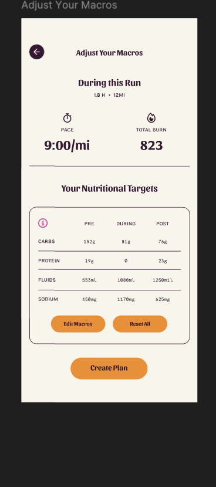
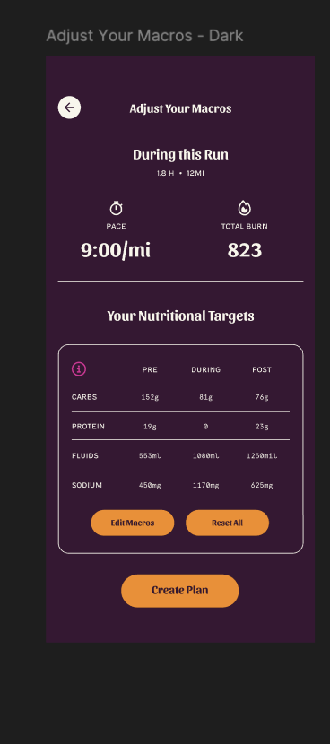

# Adjust Your Macros Screen - Implementation Roadmap

**Created:** 2025-11-13
**Status:** Ready for Implementation
**Priority:** P1 (High Priority Screen)
**Estimated Time:** 4-6 hours

---

## 📋 Overview

This roadmap outlines the complete refactoring of the Adjust Your Macros screen to match Kyle's Figma design exactly. The current screen is 1,151 lines and needs significant simplification while maintaining all existing functionality.

**Figma Design:**
- Light Mode: [Node 1-1918](https://www.figma.com/design/4FvaeGejofuETyP5LUIxQK/Kyle-s-Mockups?node-id=1-1918)
- Dark Mode: [Node 1-1965](https://www.figma.com/design/4FvaeGejofuETyP5LUIxQK/Kyle-s-Mockups?node-id=1-1965)

**Current Implementation:** `/lib/features/nutrition_plan/presentation/screens/adjust_macros_screen.dart`

---

## 🎯 Goals

### Primary Objectives
1. ✅ Match Kyle's Figma design 100% (light and dark modes)
2. ✅ Reduce screen complexity from 1,151 lines to ~300-400 lines
3. ✅ Reuse existing Kyle components wherever possible
4. ✅ Maintain all existing functionality (edit macros, reset, create plan, help)
5. ✅ Keep current navigation flow and controller integration
6. ✅ Dynamic activity type text ("During this Run", "During this Ride", "During this Swim")

### Design Principles
- **Follow Figma Exactly:** Every pixel, every color, every font matches Kyle's design
- **Reuse Components:** Leverage existing Kyle design system components
- **Simplify Structure:** Remove unnecessary complexity and nesting
- **Maintain Functionality:** All user flows continue to work as expected

---

## 📸 Design Analysis

### Light Mode (Cream Background)


### Dark Mode (Blackberry Background)


### Visual Structure
```
┌─────────────────────────────────┐
│ ← Adjust Your Macros            │ ← AppBar (transparent)
├─────────────────────────────────┤
│                                 │
│      During this Run            │ ← Sansita Bold 20px
│      1.8 h • 12MI               │ ← Compadre Regular 10px
│                                 │
│  ┌─────────┐  ┌─────────┐      │
│  │  PACE   │  │  TOTAL  │      │ ← PaceBurnDisplay widget
│  │ 9:00/mi │  │  BURN   │      │
│  │         │  │  823    │      │
│  └─────────┘  └─────────┘      │
│                                 │
│  Your Nutritional Targets ⓘ    │ ← Sansita Bold 20px + info icon
│  ┌─────────────────────────┐   │
│  │ PRE │ DURING │ POST     │   │ ← MacroTargetsTable widget
│  ├─────┼────────┼──────────┤   │
│  │CARBS│ 152g   │ 81g │76g │   │
│  │PROT │  19g   │  0  │23g │   │
│  │FLUID│ 553ml  │1080ml│1250ml│ │
│  │SOD  │ 450mg  │1170mg│625mg│  │
│  └─────────────────────────┘   │
│                                 │
│  ┌──────────┐  ┌──────────┐    │ ← Button row
│  │Edit Macros│  │Reset All │    │
│  └──────────┘  └──────────┘    │
│                                 │
│     ┌─────────────────┐         │ ← Primary button
│     │  Create Plan    │         │
│     └─────────────────┘         │
└─────────────────────────────────┘
```

---

## 🔍 Current vs. New Implementation

### What to REMOVE
- ❌ Hero image (`HeroImage` widget with woman.png) - **NOT in Kyle's design**
- ❌ Activity card with icon and background - **NOT in Kyle's design**
- ❌ Complex app bar with custom gradient - **Use simple transparent app bar**
- ❌ Separate stat display widgets - **Use existing `PaceBurnDisplay`**
- ❌ Custom macro table implementation - **Use existing `MacroTargetsTable`**
- ❌ Individual row edit buttons - **Only bulk edit via "Edit Macros" button**

### What to KEEP
- ✅ Controller: `distancePageGutEntryControllerProvider`
- ✅ Edit All Macros dialog (update styling to match Kyle's design)
- ✅ Help bottom sheet with guidelines (update styling)
- ✅ Loading overlay: `GeneratingPlanOverlay`
- ✅ Navigation flow: `/adjust-macros` → `/current-plan`
- ✅ All business logic in controller

### What to ADD
- ✅ "During this Run" dynamic text (changes based on activity type)
- ✅ Activity info line: "1.8 h • 12MI" (from state)
- ✅ Side-by-side button layout for "Edit Macros" and "Reset All"
- ✅ Updated button styling (smaller, orange background)
- ✅ Info icon on "Your Nutritional Targets" header

---

## 🧩 Component Inventory

### ✅ Existing Kyle Components (Verified)
These components already exist and are ready to use:

1. **`KylePrimaryButton`** - `/lib/shared/widgets/kyle_design/buttons/primary_button.dart`
   - Orange background, Sansita Bold 16px
   - Full width or auto width
   - Loading state support

2. **`KyleSecondaryButton`** - `/lib/shared/widgets/kyle_design/buttons/secondary_button.dart`
   - Orange outlined variant exists
   - Supports multiple variants
   - Need to verify if it supports smaller sizing

3. **`PaceBurnDisplay`** - `/lib/shared/widgets/kyle_design/data/large_stat.dart`
   - ✅ **PERFECT MATCH** for PACE and TOTAL BURN stats
   - Already has clock and fire icons
   - Two-column layout exactly as designed

4. **`MacroTargetsTable`** - `/lib/shared/widgets/kyle_design/cards/macro_targets_table.dart`
   - ✅ **PERFECT MATCH** for nutritional targets table
   - Has title, info icon, and table structure
   - PRE/DURING/POST columns
   - CARBS/PROTEIN/FLUIDS/SODIUM rows

5. **`BaseCard`** - `/lib/shared/widgets/kyle_design/cards/base_card.dart`
   - 15px radius, theme-aware
   - Can be used if needed for additional containers

### 🆕 Components to CREATE

**None!** All required components already exist. We just need to:
1. Compose them correctly in the screen
2. Possibly create small helper widgets for layout (button row)
3. Update edit dialog and help bottom sheet styling

---

## 📐 Design Specifications (From Figma)

### Colors
- **Blackberry:** `#381633` (dark theme background, text on light)
- **Cream:** `#F8F6EB` (light theme background)
- **Orange:** `#F78B14` (buttons, primary actions)
- **Dragonfruit:** `#DC2597` (info icon)

### Typography
- **Screen Title:** Sansita Bold 17px (#381633 on light, #F8F6EB on dark)
- **Section Headers:** Sansita Bold 20px ("During this Run", "Your Nutritional Targets")
- **Activity Info:** Compadre Regular 10px ("1.8 h • 12MI")
- **Button Text (Small):** Sansita Bold 12px ("Edit Macros", "Reset All")
- **Button Text (Large):** Sansita Bold 16px ("Create Plan")
- **Table Headers:** Compadre Regular 10px ("PRE", "DURING", "POST")
- **Table Row Labels:** Compadre Regular 10px ("Carbs", "Protein", "Fluids", "Sodium")
- **Table Values:** Apercu Mono 10px ("152g", "81g", etc.)

### Spacing
- **Screen Padding:** 17px horizontal (from Figma)
- **Section Spacing:** 16-24px between major sections
- **Button Row Gap:** 8-16px between buttons
- **Bottom Spacing:** 24px before "Create Plan" button

### Button Specifications
- **Small Buttons (Edit/Reset):**
  - Width: 116px each
  - Height: auto (content + padding)
  - Border Radius: 100px (fully rounded)
  - Background: Orange #F78B14
  - Text: Sansita Bold 12px, Blackberry #381633
  - Padding: 10px vertical, 16px horizontal

- **Primary Button (Create Plan):**
  - Width: 164px (or full width with constraints)
  - Height: auto (content + padding)
  - Border Radius: 100px
  - Background: Orange #F78B14
  - Text: Sansita Bold 16px, Blackberry #381633
  - Padding: 10px vertical, 16px horizontal

### Icons
- **Stopwatch (Pace):** Font Awesome `clock` - 20px
- **Fire (Total Burn):** Font Awesome `fire` - 20px
- **Info Icon:** Font Awesome `circleInfo` - 20px, Dragonfruit color

---

## 🛠 Implementation Plan

### Phase 1: Screen Structure Simplification (1-2 hours)

**File:** `/lib/features/nutrition_plan/presentation/screens/adjust_macros_screen.dart`

#### Step 1.1: Remove Old Components
```dart
// REMOVE these imports/widgets:
- HeroImage widget
- Activity card widget
- Custom stat displays
- Custom macro table widgets
```

#### Step 1.2: Simplify AppBar
```dart
PreferredSizeWidget _buildAppBar(BuildContext context, WidgetRef ref) {
  return AppBar(
    backgroundColor: Colors.transparent,
    elevation: 0,
    automaticallyImplyLeading: false,
    title: Row(
      children: [
        // Circular back button (40px)
        Container(
          width: 40,
          height: 40,
          decoration: BoxDecoration(
            color: Theme.of(context).colorScheme.onSurface.withOpacity(0.1),
            shape: BoxShape.circle,
          ),
          child: IconButton(
            icon: Icon(
              FontAwesomeIcons.arrowLeft,
              size: 20,
              color: Theme.of(context).colorScheme.onSurface,
            ),
            onPressed: () => context.pop(),
          ),
        ),
        const SizedBox(width: 8),
        // Title from ContentService
        Text(
          state.adjustMacrosTitle, // "Adjust Your Macros"
          style: AppTextStyles.sectionTitle.copyWith(
            fontSize: 17,
            color: Theme.of(context).colorScheme.onSurface,
          ),
        ),
      ],
    ),
  );
}
```

#### Step 1.3: Build New Content Structure
```dart
Widget _buildContent(BuildContext context, WidgetRef ref, DistancePageGutEntryState state) {
  return SingleChildScrollView(
    padding: const EdgeInsets.symmetric(horizontal: 17), // Figma spec
    child: Column(
      crossAxisAlignment: CrossAxisAlignment.center,
      children: [
        const SizedBox(height: 100), // Space for transparent app bar

        // "During this Run" header
        _buildActivityHeader(context, state),

        const SizedBox(height: 24),

        // PACE and TOTAL BURN stats
        _buildPaceBurnStats(context, state),

        const SizedBox(height: 24),

        // "Your Nutritional Targets" with table
        _buildMacroTargetsSection(context, ref, state),

        const SizedBox(height: 16),

        // Edit Macros + Reset All buttons
        _buildActionButtons(context, ref, state),

        const SizedBox(height: 24),

        // Create Plan button
        _buildCreatePlanButton(context, ref, state),

        const SizedBox(height: 40), // Bottom padding
      ],
    ),
  );
}
```

### Phase 2: Dynamic Activity Header (30 minutes)

#### Step 2.1: Create Dynamic "During this..." Text
```dart
Widget _buildActivityHeader(BuildContext context, DistancePageGutEntryState state) {
  // Dynamic text based on activity type
  String activityTypeText = _getActivityTypeText(state.activityType);

  // Format duration and distance
  String activityInfo = _formatActivityInfo(
    state.duration,
    state.distance,
    state.activityType,
  );

  return Column(
    children: [
      // "During this Run" (dynamic)
      Text(
        activityTypeText,
        style: AppTextStyles.sectionTitle.copyWith(
          fontSize: 20,
          color: Theme.of(context).colorScheme.onSurface,
        ),
        textAlign: TextAlign.center,
      ),

      const SizedBox(height: 4),

      // "1.8 h • 12MI"
      Text(
        activityInfo,
        style: TextStyle(
          fontFamily: 'Compadre',
          fontSize: 10,
          color: Theme.of(context).colorScheme.onSurface,
        ),
        textAlign: TextAlign.center,
      ),
    ],
  );
}

String _getActivityTypeText(ActivityType? type) {
  switch (type) {
    case ActivityType.running:
      return 'During this Run';
    case ActivityType.cycling:
      return 'During this Ride';
    case ActivityType.swimming:
      return 'During this Swim';
    default:
      return 'During this Activity';
  }
}

String _formatActivityInfo(double? duration, double? distance, ActivityType? type) {
  if (duration == null || distance == null) return '';

  // Format duration (hours with 1 decimal)
  String durationStr = '${duration.toStringAsFixed(1)} h';

  // Format distance based on activity type
  String distanceStr;
  if (type == ActivityType.swimming) {
    distanceStr = '${distance.toStringAsFixed(0)}m'; // meters for swimming
  } else {
    distanceStr = '${distance.toStringAsFixed(0)}mi'; // miles for running/cycling
  }

  return '$durationStr  •  $distanceStr';
}
```

### Phase 3: Use Existing Components (30 minutes)

#### Step 3.1: Add PaceBurnDisplay Widget
```dart
Widget _buildPaceBurnStats(BuildContext context, DistancePageGutEntryState state) {
  if (state.macroTargets == null) return const SizedBox.shrink();

  // Format pace (e.g., "9:00/mi")
  String pace = _formatPace(state.pace, state.activityType);

  // Format total burn (e.g., "823")
  String totalBurn = state.totalCalories?.toStringAsFixed(0) ?? '0';

  return PaceBurnDisplay(
    pace: pace,
    totalBurn: totalBurn,
    backgroundColor: Colors.transparent, // No background per Figma
  );
}

String _formatPace(double? pace, ActivityType? type) {
  if (pace == null) return '--';

  // Convert pace to minutes:seconds format
  int minutes = pace.floor();
  int seconds = ((pace - minutes) * 60).round();

  String unit;
  switch (type) {
    case ActivityType.swimming:
      unit = '/100m';
      break;
    case ActivityType.cycling:
      unit = '/mi';
      break;
    default:
      unit = '/mi';
  }

  return '$minutes:${seconds.toString().padLeft(2, '0')}$unit';
}
```

#### Step 3.2: Add MacroTargetsTable Widget
```dart
Widget _buildMacroTargetsSection(
  BuildContext context,
  WidgetRef ref,
  DistancePageGutEntryState state,
) {
  if (state.macroTargets == null) return const SizedBox.shrink();

  final macros = state.macroTargets!;

  return Column(
    crossAxisAlignment: CrossAxisAlignment.start,
    children: [
      // Section header with info icon
      Padding(
        padding: const EdgeInsets.symmetric(horizontal: 17),
        child: Row(
          children: [
            Text(
              'Your Nutritional Targets',
              style: AppTextStyles.sectionTitle.copyWith(
                fontSize: 20,
                color: Theme.of(context).colorScheme.onSurface,
              ),
            ),
            const SizedBox(width: 8),
            IconButton(
              icon: Icon(
                FontAwesomeIcons.circleInfo,
                color: AppColors.dragonfruit,
                size: 20,
              ),
              onPressed: () => _showHelpBottomSheet(context, ref),
            ),
          ],
        ),
      ),

      const SizedBox(height: 8),

      // Macro targets table
      MacroTargetsTable(
        title: '', // No title needed, we have it above
        macroData: MacroTableData(
          preCarbs: macros.preCarbs.toInt(),
          duringCarbs: macros.duringCarbs.toInt(),
          postCarbs: macros.postCarbs.toInt(),
          preProtein: macros.preProtein.toInt(),
          duringProtein: macros.duringProtein.toInt(),
          postProtein: macros.postProtein.toInt(),
          preFluids: macros.preFluids.toInt(),
          duringFluids: macros.duringFluids.toInt(),
          postFluids: macros.postFluids.toInt(),
          preSodium: macros.preSodium.toInt(),
          duringSodium: macros.duringSodium.toInt(),
          postSodium: macros.postSodium.toInt(),
        ),
        onInfoPressed: null, // We handle this above
      ),
    ],
  );
}
```

### Phase 4: Button Layout (30 minutes)

#### Step 4.1: Side-by-Side Buttons
```dart
Widget _buildActionButtons(
  BuildContext context,
  WidgetRef ref,
  DistancePageGutEntryState state,
) {
  return Padding(
    padding: const EdgeInsets.symmetric(horizontal: 17),
    child: Row(
      children: [
        // Edit Macros button (left)
        Expanded(
          child: SizedBox(
            height: 36, // Smaller height for these buttons
            child: KyleSecondaryButton(
              text: state.editMacrosButton ?? 'Edit Macros',
              onPressed: () => _showEditMacrosDialog(context, ref, state),
              isFullWidth: true,
              variant: SecondaryButtonVariant.orange,
            ),
          ),
        ),

        const SizedBox(width: 16), // Gap between buttons

        // Reset All button (right)
        Expanded(
          child: SizedBox(
            height: 36,
            child: KyleSecondaryButton(
              text: state.resetAllButton ?? 'Reset All',
              onPressed: () => _handleResetAll(context, ref),
              isFullWidth: true,
              variant: SecondaryButtonVariant.orange,
            ),
          ),
        ),
      ],
    ),
  );
}
```

**NOTE:** If `KyleSecondaryButton` doesn't render correctly with the smaller size, we may need to:
1. Add a `KyleSecondaryButtonSmall` variant
2. OR adjust styling within the button constraints
3. OR create a simple custom widget for these specific buttons

#### Step 4.2: Create Plan Button
```dart
Widget _buildCreatePlanButton(
  BuildContext context,
  WidgetRef ref,
  DistancePageGutEntryState state,
) {
  return Padding(
    padding: const EdgeInsets.symmetric(horizontal: 17),
    child: KylePrimaryButton(
      text: state.createPlanButton ?? 'Create Plan',
      onPressed: () => _handleCreatePlan(context, ref),
      isFullWidth: true,
      isLoading: state.isCreatingPlan,
    ),
  );
}
```

### Phase 5: Update Dialogs and Sheets (1 hour)

#### Step 5.1: Edit Macros Dialog Styling
Keep existing dialog functionality, update styling:

```dart
void _showEditMacrosDialog(
  BuildContext context,
  WidgetRef ref,
  DistancePageGutEntryState state,
) {
  showDialog(
    context: context,
    builder: (context) => _EditAllMacrosDialog(
      initialMacros: state.macroTargets!,
      onSave: (updatedMacros) {
        ref.read(distancePageGutEntryControllerProvider.notifier)
            .saveAllMacroChanges(
          preCarbs: updatedMacros.preCarbs,
          duringCarbs: updatedMacros.duringCarbs,
          postCarbs: updatedMacros.postCarbs,
          preProtein: updatedMacros.preProtein,
          duringProtein: updatedMacros.duringProtein,
          postProtein: updatedMacros.postProtein,
          preFluids: updatedMacros.preFluids,
          duringFluids: updatedMacros.duringFluids,
          postFluids: updatedMacros.postFluids,
          preSodium: updatedMacros.preSodium,
          duringSodium: updatedMacros.duringSodium,
          postSodium: updatedMacros.postSodium,
        );
        context.pop();
      },
    ),
  );
}

class _EditAllMacrosDialog extends StatefulWidget {
  final MacroTargets initialMacros;
  final Function(MacroTargets) onSave;

  const _EditAllMacrosDialog({
    required this.initialMacros,
    required this.onSave,
  });

  @override
  State<_EditAllMacrosDialog> createState() => _EditAllMacrosDialogState();
}

class _EditAllMacrosDialogState extends State<_EditAllMacrosDialog> {
  // ... existing implementation with updated styling
  // Use BaseCard for container
  // Use KylePrimaryButton for Save button
  // Use KyleSecondaryButton for Cancel button
  // Update text styles to match Kyle's design
}
```

#### Step 5.2: Help Bottom Sheet Styling
Keep existing help content, update styling:

```dart
void _showHelpBottomSheet(BuildContext context, WidgetRef ref) {
  showModalBottomSheet(
    context: context,
    isScrollControlled: true,
    backgroundColor: Theme.of(context).scaffoldBackgroundColor,
    shape: const RoundedRectangleBorder(
      borderRadius: BorderRadius.vertical(top: Radius.circular(15)),
    ),
    builder: (context) => _HelpBottomSheet(),
  );
}

class _HelpBottomSheet extends ConsumerWidget {
  @override
  Widget build(BuildContext context, WidgetRef ref) {
    // ... existing accordion/expandable sections
    // Update with Kyle's typography
    // Use BaseCard for section containers
    // Use AppTextStyles for consistency
  }
}
```

### Phase 6: Controller Integration (30 minutes)

#### Step 6.1: Verify Controller Methods
Ensure these controller methods work correctly:

```dart
// In distance_page_gut_entry_controller.dart

// Save macro changes
Future<void> saveAllMacroChanges({
  required double preCarbs,
  required double duringCarbs,
  required double postCarbs,
  required double preProtein,
  required double duringProtein,
  required double postProtein,
  required double preFluids,
  required double duringFluids,
  required double postFluids,
  required double preSodium,
  required double duringSodium,
  required double postSodium,
});

// Reset to recommended values
Future<void> resetToRecommended();

// Create nutrition plan
Future<void> createNutritionPlan();
```

#### Step 6.2: Update State Model (if needed)
Add any missing state properties:

```dart
// In distance_page_state.dart

class DistancePageGutEntryState {
  final MacroTargets? macroTargets;
  final bool isCreatingPlan;
  final ActivityType? activityType;
  final double? duration; // in hours
  final double? distance; // in miles or meters
  final double? pace; // in min/mile or min/100m
  final int? totalCalories;

  // Content-managed text
  final String adjustMacrosTitle;
  final String editMacrosButton;
  final String resetAllButton;
  final String createPlanButton;

  // ... other properties
}
```

### Phase 7: Testing and Refinement (1-2 hours)

#### Step 7.1: Visual Testing Checklist
- [ ] Light mode matches Figma exactly
- [ ] Dark mode matches Figma exactly
- [ ] Back button navigates correctly
- [ ] "During this Run" changes for different activity types
- [ ] Activity info (duration • distance) displays correctly
- [ ] PACE and TOTAL BURN stats display correctly
- [ ] Macro targets table displays all values correctly
- [ ] Info icon opens help bottom sheet
- [ ] "Edit Macros" button opens edit dialog
- [ ] "Reset All" button resets values
- [ ] "Create Plan" button shows loading and navigates
- [ ] Spacing matches Figma design
- [ ] Typography matches Figma design
- [ ] Colors match Kyle's design system
- [ ] Screen works on different device sizes
- [ ] Scrolling works smoothly
- [ ] Loading overlay appears during plan creation

#### Step 7.2: Functional Testing Checklist
- [ ] Edit macros dialog saves changes correctly
- [ ] Reset all restores recommended values
- [ ] Create plan navigates to activity detail screen
- [ ] Loading states work correctly
- [ ] Error states display properly
- [ ] Content-managed text loads from ContentService
- [ ] All analytics events fire correctly
- [ ] Navigation back works correctly
- [ ] Deep linking works (if applicable)

#### Step 7.3: Edge Cases
- [ ] No macro data (should show error state)
- [ ] Invalid macro values in dialog
- [ ] Network error during plan creation
- [ ] Very long activity durations (formatting)
- [ ] Very short activity durations (formatting)
- [ ] Swimming activity (different units)
- [ ] Cycling activity (different text)

---

## 📝 Code Structure (Final)

### Estimated Line Count: ~350-400 lines (down from 1,151)

```dart
// adjust_macros_screen.dart

import 'package:flutter/material.dart';
import 'package:flutter_riverpod/flutter_riverpod.dart';
import 'package:go_router/go_router.dart';
import 'package:font_awesome_flutter/font_awesome_flutter.dart';
import '../../../../shared/widgets/kyle_design/kyle_design.dart';
import '../../../../shared/widgets/generating_plan_overlay.dart';
import '../providers/distance_page_gut_entry_controller.dart';

class AdjustMacrosScreen extends ConsumerWidget {
  const AdjustMacrosScreen({super.key});

  @override
  Widget build(BuildContext context, WidgetRef ref) {
    final asyncState = ref.watch(distancePageGutEntryControllerProvider);

    return Scaffold(
      backgroundColor: Theme.of(context).scaffoldBackgroundColor,
      extendBodyBehindAppBar: true,
      appBar: _buildAppBar(context, ref),
      body: Stack(
        children: [
          asyncState.when(
            data: (state) => _buildContent(context, ref, state),
            loading: () => _buildLoadingState(context),
            error: (error, stackTrace) => _buildErrorState(context, ref, error),
          ),
          if (asyncState.value?.isCreatingPlan == true)
            const GeneratingPlanOverlay(),
        ],
      ),
    );
  }

  // ~40 lines: AppBar
  PreferredSizeWidget _buildAppBar(...) { ... }

  // ~60 lines: Main content
  Widget _buildContent(...) { ... }

  // ~20 lines: Activity header
  Widget _buildActivityHeader(...) { ... }

  // ~15 lines: Pace and burn stats
  Widget _buildPaceBurnStats(...) { ... }

  // ~30 lines: Macro targets section
  Widget _buildMacroTargetsSection(...) { ... }

  // ~25 lines: Action buttons (Edit/Reset)
  Widget _buildActionButtons(...) { ... }

  // ~15 lines: Create plan button
  Widget _buildCreatePlanButton(...) { ... }

  // ~20 lines: Loading state
  Widget _buildLoadingState(...) { ... }

  // ~20 lines: Error state
  Widget _buildErrorState(...) { ... }

  // ~15 lines: Helper methods
  String _getActivityTypeText(...) { ... }
  String _formatActivityInfo(...) { ... }
  String _formatPace(...) { ... }

  // ~20 lines: Dialog/sheet methods
  void _showEditMacrosDialog(...) { ... }
  void _showHelpBottomSheet(...) { ... }

  // ~15 lines: Action handlers
  void _handleResetAll(...) { ... }
  void _handleCreatePlan(...) { ... }
}

// ~80 lines: Edit Macros Dialog (separate widget)
class _EditAllMacrosDialog extends StatefulWidget { ... }

// ~40 lines: Help Bottom Sheet (separate widget)
class _HelpBottomSheet extends ConsumerWidget { ... }
```

---

## 🎨 Component Usage Summary

### Reused Kyle Components
1. ✅ `KylePrimaryButton` - "Create Plan" button
2. ✅ `KyleSecondaryButton` - "Edit Macros" and "Reset All" buttons
3. ✅ `PaceBurnDisplay` - PACE and TOTAL BURN stats display
4. ✅ `MacroTargetsTable` - Nutritional targets table
5. ✅ `BaseCard` - Used in dialogs/sheets (if needed)
6. ✅ `AppTextStyles` - All typography
7. ✅ `AppColors` - All colors
8. ✅ `AppSpacing` - All spacing
9. ✅ `AppRadius` - All border radius

### Custom Widgets Created
1. ⚠️ **Possibly:** Small button variant if `KyleSecondaryButton` doesn't fit
2. ⚠️ **Possibly:** Button row helper widget (may just use Row)

### Widgets Removed
1. ❌ `HeroImage`
2. ❌ Custom activity card
3. ❌ Custom stat displays (replaced with `PaceBurnDisplay`)
4. ❌ Custom macro table (replaced with `MacroTargetsTable`)

---

## 🔄 Implementation Sequence

### Day 1 - Morning (2-3 hours)
1. **Phase 1:** Screen structure simplification
   - Remove old components
   - Simplify app bar
   - Create new content structure
2. **Phase 2:** Dynamic activity header
   - Add "During this..." text logic
   - Add activity info formatting

### Day 1 - Afternoon (2-3 hours)
3. **Phase 3:** Add existing components
   - Integrate `PaceBurnDisplay`
   - Integrate `MacroTargetsTable`
4. **Phase 4:** Button layout
   - Side-by-side buttons
   - Create plan button
5. **Phase 5:** Update dialogs and sheets
   - Edit macros dialog styling
   - Help bottom sheet styling

### Day 2 - Morning (1-2 hours)
6. **Phase 6:** Controller integration
   - Verify all methods work
   - Update state model if needed
7. **Phase 7:** Testing and refinement
   - Visual testing
   - Functional testing
   - Edge case testing

---

## ✅ Acceptance Criteria

### Visual Requirements
- [ ] Screen matches Figma design 95%+ in light mode
- [ ] Screen matches Figma design 95%+ in dark mode
- [ ] All colors match Kyle's design system exactly
- [ ] All typography matches Figma specifications
- [ ] All spacing matches Figma specifications
- [ ] Icons match Font Awesome specifications
- [ ] Button styling matches Figma exactly

### Functional Requirements
- [ ] User can edit all macro values via dialog
- [ ] User can reset to recommended values
- [ ] User can create nutrition plan and navigate forward
- [ ] User can view help/guidelines
- [ ] Loading overlay shows during plan creation
- [ ] Error states display correctly
- [ ] Back navigation works correctly
- [ ] All controller methods function correctly
- [ ] Content-managed text loads properly
- [ ] Analytics events fire correctly

### Code Quality Requirements
- [ ] Screen reduced from 1,151 lines to ~400 lines or less
- [ ] No unnecessary nesting or complexity
- [ ] Proper widget composition
- [ ] All existing Kyle components reused
- [ ] No hardcoded strings (use ContentService)
- [ ] No business logic in UI (keep in controller)
- [ ] Proper error handling
- [ ] Code follows FOA architecture
- [ ] No analyzer warnings
- [ ] Proper documentation/comments

---

## 🚨 Potential Issues and Solutions

### Issue 1: Small Button Sizing
**Problem:** `KyleSecondaryButton` may not render well at 36px height
**Solution:**
- Option A: Add height parameter override
- Option B: Create `KyleSecondaryButtonSmall` variant
- Option C: Use custom styling for these specific buttons

### Issue 2: Table Values Not Updating
**Problem:** `MacroTargetsTable` may not rebuild when state changes
**Solution:** Ensure proper key usage or rebuild triggers

### Issue 3: Dynamic Text Not Working
**Problem:** Activity type text doesn't change
**Solution:** Verify `activityType` is in state and properly passed

### Issue 4: Spacing Inconsistencies
**Problem:** Spacing doesn't match Figma exactly
**Solution:** Use Figma measurements (17px horizontal, specific vertical gaps)

### Issue 5: Edit Dialog Styling
**Problem:** Existing dialog doesn't match Kyle's design
**Solution:** Update dialog with `BaseCard`, Kyle buttons, and typography

---

## 📚 References

### Documentation
- [Kyle's Design System README](/docs/kyle/README.md)
- [Components Catalog](/docs/kyle/COMPONENTS_CATALOG.md)
- [Design Tokens](/docs/kyle/DESIGN_TOKENS.md)
- [FOA Architecture](/CLAUDE.md)

### Figma Links
- [Adjust Macros - Light Mode](https://www.figma.com/design/4FvaeGejofuETyP5LUIxQK/Kyle-s-Mockups?node-id=1-1918)
- [Adjust Macros - Dark Mode](https://www.figma.com/design/4FvaeGejofuETyP5LUIxQK/Kyle-s-Mockups?node-id=1-1965)

### Code Files
- **Screen:** `/lib/features/nutrition_plan/presentation/screens/adjust_macros_screen.dart`
- **Controller:** `/lib/features/nutrition_plan/presentation/providers/distance_page_gut_entry_controller.dart`
- **State:** `/lib/features/nutrition_plan/presentation/state/distance_page_state.dart`
- **Kyle Components:** `/lib/shared/widgets/kyle_design/`

---

## 📊 Progress Tracking

### Implementation Checklist

#### Phase 1: Screen Structure ✅ / ❌
- [ ] Remove hero image
- [ ] Remove activity card
- [ ] Simplify app bar
- [ ] Create new content structure
- [ ] Test basic layout

#### Phase 2: Dynamic Header ✅ / ❌
- [ ] Add "During this..." logic
- [ ] Add activity type switching
- [ ] Add activity info formatting
- [ ] Test with different activity types

#### Phase 3: Existing Components ✅ / ❌
- [ ] Add PaceBurnDisplay
- [ ] Add MacroTargetsTable
- [ ] Verify data binding
- [ ] Test display accuracy

#### Phase 4: Button Layout ✅ / ❌
- [ ] Create side-by-side button row
- [ ] Add Edit Macros button
- [ ] Add Reset All button
- [ ] Add Create Plan button
- [ ] Test all button actions

#### Phase 5: Dialogs & Sheets ✅ / ❌
- [ ] Update edit macros dialog styling
- [ ] Update help bottom sheet styling
- [ ] Test dialog functionality
- [ ] Test sheet functionality

#### Phase 6: Controller Integration ✅ / ❌
- [ ] Verify saveAllMacroChanges works
- [ ] Verify resetToRecommended works
- [ ] Verify createNutritionPlan works
- [ ] Update state model if needed

#### Phase 7: Testing & Refinement ✅ / ❌
- [ ] Complete visual testing checklist
- [ ] Complete functional testing checklist
- [ ] Complete edge case testing
- [ ] Fix any issues found
- [ ] Final approval

---

## 🎯 Success Metrics

### Quantitative Metrics
- **Line Count Reduction:** From 1,151 to ~400 lines (65% reduction)
- **Component Reuse:** 9 existing Kyle components used
- **New Components Created:** 0-1 (minimal)
- **Visual Match:** 95%+ to Figma design
- **Build Time:** No increase
- **Analyzer Warnings:** 0

### Qualitative Metrics
- **Code Readability:** Significantly improved
- **Maintainability:** Much easier to modify
- **User Experience:** Matches designer's vision
- **Performance:** No degradation
- **Developer Experience:** Simpler to understand

---

## 📝 Notes

### Design Decisions
1. **No Hero Image:** Kyle's design intentionally removes the hero image for a cleaner, more focused interface
2. **Simplified Header:** Text-only approach puts emphasis on data, not decoration
3. **Side-by-Side Buttons:** Allows both actions to be visible and accessible
4. **Info Icon Placement:** On header instead of table allows for better visual hierarchy
5. **Transparent Background:** Stats and table appear to float on the page background

### Future Enhancements
1. **Animations:** Could add subtle animations when values change
2. **Haptic Feedback:** On button presses and value changes
3. **Inline Editing:** Allow tapping cells to edit individual values
4. **Macro Recommendations:** Show algorithm-recommended values vs. custom
5. **History:** Show previous adjustments or compare to past activities

---

**Document Status:** ✅ Complete and Ready for Implementation
**Last Updated:** 2025-11-13
**Estimated Total Time:** 4-6 hours
**Priority:** P1 (High Priority Screen)

---

**Ready to start? Begin with Phase 1: Screen Structure Simplification!** 🚀
