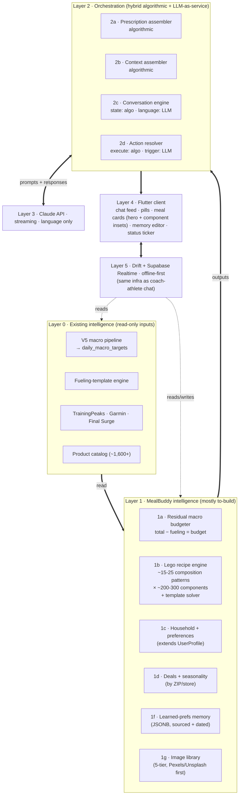
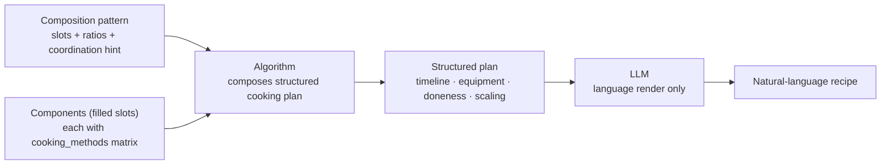
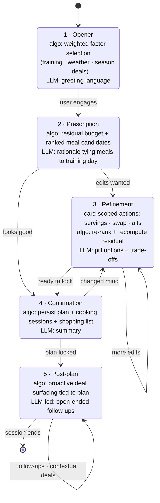

# AI Assistant — Technical Architecture & System Design

- **Source:** https://app.notion.com/p/33ee3fdb754c81dab2f8dff51c73bd19
- **Icon:** 🏗️
- **Ancestor path:** AI Assistant → Technical and Product Documentation (data source) → Technical and Product Documentation → Features → (untitled) → (untitled) → Homepage
- **Snapshot as of:** 2026-05-08T20:57:35.458Z
- **No page-level discussions found on this page.**

---

# Overview

This document defines the technical architecture for MealBuddy, the Mealvana AI Assistant.

**Strategic role.** Performance nutrition is the **hook** — what brings athletes in and what makes Mealvana Endurance unique. Meal planning is the **retention driver** — almost every athlete and coach we've spoken with has asked for it. MealBuddy is therefore not a side feature; it's the bridge from trial to habit, and (longer term) the bridge from Endurance to mealvana.io.

**Scope clarification (important).** Mealvana Endurance already ships competent **performance nutrition**: pre-, during-, and post-workout fueling driven by the V5 daily-macro pipeline and the fueling-template engine (built with Dr. Rachel Mitchell). MealBuddy is **not** an assistant for performance nutrition. MealBuddy plans the **rest of the day** — breakfasts, lunches, dinners, and non-fueling snacks — by consuming the daily macro target and subtracting the calories/macros already allocated to performance nutrition. The residual is what MealBuddy distributes across actual meals.

**Core philosophy:** Mealvana's proprietary systems compute *what to eat* at the macro level. MealBuddy makes the *meal-by-meal* plan conversational, household-aware, and adaptive. The LLM is the communication layer on top of a proprietary intelligence stack — it translates structured outputs into natural language, handles edge cases through conversation, and feeds learned preferences back into the data layer.

We are not building an LLM wrapper. The LLM (Claude) cannot replicate what makes Mealvana valuable: the V5 macro pipeline, the fueling-template library, the coach-validated nutrition logic built with Dr. Rachel Mitchell, and the integration pipeline (TrainingPeaks, Garmin, Final Surge). Those are existing assets — they belong to the broader Endurance product. MealBuddy's *own* moat is different and largely unbuilt: the **residual macro budgeter**, the **recipe corpus**, the **household-and-preference model**, the **deal/seasonal awareness**, and the **learned-preferences memory**. The LLM is the interface — replaceable. The intelligence stacks (existing + MealBuddy's) are not.

The architecture is designed around four principles:

1. **Proprietary engine first** — Mealvana's algorithms and data assets are the center of gravity. The LLM consumes their outputs, never replaces them.
2. **LLM as communication layer** — Claude translates computed outputs into natural conversation, handles ambiguity, and personalizes delivery. It does not "decide" nutrition.
3. **User memory as explicit artifact** — The user's preferences and context are stored as an editable structure, not a black box.
4. **Structured conversation blocks** — Conversations follow composable block sequences, not free-form chat. This enables proactive behavior and UI richness.

---

# Performance nutrition vs. meal planning

These are two products, not one. MealBuddy concerns itself only with the right-hand column.

| | Performance nutrition (already shipped) | Meal planning (MealBuddy) |
|---|---|---|
| Scope | Pre / during / post workout fueling windows | Breakfast, lunch, dinner, non-fueling snacks |
| Time horizon | Minutes-to-hours around a workout | Daily / weekly / household |
| Intelligence | V5 macro pipeline + fueling-template engine + gut-training tiers + brick handling | Residual macro budgeter, recipe matching, household/budget logic, deal/seasonal awareness, learned preferences |
| Coach interest | High (training-adjacent) | Low — only nutrition coaches care |
| Status | Live in Endurance v1.18.x | Largely unbuilt |

The handoff is a single per-day calculation: `meal_planning_budget = daily_total_target − performance_nutrition_allocated`. MealBuddy reads that residual and plans meals against it.

---

# Architecture: existing engine + MealBuddy stack + LLM interface

The full stack at a glance:



The defining principle, visible in every layer: **algorithmic computation owns macros, constraints, food safety, and matching; the LLM owns language and conversation only.** Layers 0–2 are deterministic. Layer 3 is bounded language. Layers 4–5 are presentation and persistence.

What changed in the latest pass: Layer 1's recipe engine now uses **~15-25 composition patterns** (slot shapes + coordination hints) instead of ~50-150 cooking-blueprint templates. Cooking knowledge moved entirely onto components, where the `cooking_methods` matrix already lived. The data shape now matches Mealvana's existing meal-card UI (hero + circular component insets), so the architecture follows the shipped product instead of fighting it.

## Layer 0 — Existing intelligence stack (read-only inputs to MealBuddy)

These assets exist in production and are owned by the broader Endurance app. MealBuddy reads from them; it does not extend or rewrite them.

### V5 daily-macro pipeline

A 5-iteration calculator implemented as a Supabase edge function (`calculate-daily-macros`). Pipeline iterations:

1. Baseline RMR, TDEE, macros with session demands
2. Multi-day context (recovery, pre-load, weekly load, training phase)
3. Dynamic NEAT + iterative TEF
4. Safety (energy availability check, multi-session compounding, carb cycling)
5. Garmin body-composition integration + daily summary

Sport-specific configs (running, cycling, swimming, brick) live in `supabase/functions/_shared/nutrition/sport-configs/`. Output (per-day macro target with `algorithm_version` stamp) is persisted to `daily_macro_targets`. **MealBuddy reads this table — it does not invoke the pipeline.**

### Fueling-template engine

Pre-, during-, and post-workout templates curated with Dr. Rachel Mitchell. Lives in Supabase (`pre_workout_templates`, `template_foods`, `post_workout_templates`) plus Drift mirrors for personal templates. Selection is deterministic (template solver in `_shared/nutrition/templates/meal-chain.ts`). **MealBuddy does not display or modify fueling templates.** It only consumes the *aggregate macros allocated to fueling* on a given day so it can subtract them from the residual.

### Integration pipelines

- **TrainingPeaks** — OAuth + sync + transformer + write-back. Pulls sport, duration, intensity, description; computes TSS.
- **Garmin** — OAuth callback, push, ping, deregistration; tables for user mappings and health data; pulls daily summaries (BMR, active kcal) and body composition (weight, body-fat %). Feeds Iteration 5 of the macro pipeline. Auto-fills weight/body-fat until the user manually edits.
- **Final Surge** — OAuth + sync; same shape as TrainingPeaks.

### Product catalog

`catalog_products` and `catalog_variants` in Supabase, sourced from Shopify with classification metadata (`classification_source = 'claude' | 'manual'`). ~1,600+ variants. Used by the fueling-template engine, **not** by MealBuddy directly.

### Coach mode (Endurance v1.18.x)

Coach dashboard, athlete list, coach-athlete chat (Supabase Realtime), activity feedback. Coaches see training and performance nutrition, **not meal plans**. MealBuddy outputs are surfaced to coaches only for users explicitly working with a nutrition coach (opt-in, future).

---

## Layer 1 — MealBuddy intelligence stack (mostly to be built)

This is MealBuddy's *own* moat. Most of it doesn't exist yet.

### 1a. Residual macro budgeter (new)

Reads the day's `daily_macro_targets` row + the day's allocated fueling-template macros, subtracts, and produces:

```json
{
  "date": "2026-04-13",
  "total_target": {"calories": 2850, "carbs_g": 380, "protein_g": 142, "fat_g": 78},
  "performance_nutrition_allocated": {"calories": 520, "carbs_g": 130, "protein_g": 18, "fat_g": 8},
  "meal_planning_budget": {"calories": 2330, "carbs_g": 250, "protein_g": 124, "fat_g": 70},
  "context": {"recovery_priority": "high", "evening_long_run_next_day": true, "algorithm_version": "v5.0.0"}
}
```

Deterministic, auditable, cached. MealBuddy plans against `meal_planning_budget`, not against the total.

### 1b. Lego recipe engine (new — not a recipe corpus)

We are not building a recipe database. The world has too many recipes already; the differentiator is not having more, it's serving the *right* one. Following a HungryRoot-style model, MealBuddy generates meals from a small library of modular base templates that flex through ingredient substitution. **Variety is combinatorial, not curated.**

Three sub-components:

**(i) Composition patterns** — ~15-25 curated meal patterns, each a structural skeleton with named slots. Validated by Dr. Rachel Mitchell. **A pattern defines what goes together, not how to cook it.** Cooking knowledge — temperature, time, doneness, prep notes — lives on each component (see ii); the pattern just encodes slot shape and any cross-component coordination needed.

Each composition pattern encodes:
- **Slot definitions** — which slot types are required, which are optional (e.g., `bowl` = 1 base + 1 protein + 1-2 veg + 1 sauce)
- **Per-serving ratios at the slot level** (e.g., 6 oz protein + 1.5 cups vegetable + 0.5 cup cooked grain), so scaling and macro composition stay deterministic
- **Optional coordination hint** for cross-component concerns: "shared oven session" (sheet pan), "stovetop + cold side" (grain bowl), "active hands + passive timer" (risotto + roast). When present, it constrains compatible components and tells the renderer how to merge timelines.

Examples:
- Sheet pan: 1 protein + 1-2 vegetables + 1 sauce — *coordination: shared oven*
- Grain bowl: 1 base + 1 protein + 1-2 vegetables + 1 dressing — *coordination: stovetop + cold dressing*
- Stir fry: 1 protein + 2-3 vegetables + 1 sauce + 1 grain — *coordination: high heat, fast sequence*
- Wrap / handheld: 1 protein + 1-2 vegetables + 1 spread + 1 carrier
- Soup pot, salad bowl, pasta night, breakfast plate, etc.

**This model matches Mealvana's existing meal-card UI**, which already shows a meal as one main + circular component insets — each component first-class and individually swappable. The composition pattern is the data shape behind that visual.

**Most cooking knowledge lives on components, not on the pattern.** This keeps the pattern library tiny (a one-week build) and makes variety combinatorial in two dimensions: pattern × component fits per slot.

**(ii) Component database** — ~200-300 ingredients (proteins, vegetables, grains, fats, seasonings, sauces). Each is a first-class object — what the user sees in the meal-card circular insets. Individually swappable, individually macroed, individually photographed. Each component carries:
- Macros per serving (deterministic — no LLM math)
- Allergen flags
- Seasonality
- Cost estimates
- Substitution affinity (which components swap well for each other)
- Household friendliness (kid-acceptable, etc.)
- **Cooking methods matrix** — for each method the component supports, the parameters: time-at-temperature, doneness indicator, target internal temperature, prep notes. e.g., salmon supports `oven_425`, `pan_sear`, `grill`, `poach`; each method has its own parameters. Most components support 3-5 methods; the matrix is sparse but structured.
- **Image references** — hero shot, thumbnail, cooked variant, plus attribution metadata (see 1g)

This is dramatically smaller than a recipe corpus — a few hundred components covers the realistic palette.

**(iii) Template solver** — Given residual budget, user preferences, household, seasonality, deals, and variety constraints (what was eaten this week), the solver fills each slot with the best component. Output is a fully-specified meal with deterministic macros computed from components.

**The solver is mostly algorithmic, NOT a pure LLM call.** This is critical — the output meal engine is a constraint satisfaction problem, and LLMs are notoriously bad at constraint satisfaction (invalid solutions, hallucinated components, inconsistent macros, dropped constraints mid-reasoning). Deterministic code excels at it. The LLM has narrow, edge-only responsibilities.

| Step | Algorithmic or LLM? | Detail |
|---|---|---|
| 1. Inputs | Algorithmic | Read residual budget, profile, household, history, deals, season from typed sources. |
| 2. Parse natural-language constraints | LLM (optional) | Only when the user spoke. "Quick tonight" → `prep_time ≤ 30min`. Skipped if planning is system-initiated. |
| 3. Hard constraint filtering | Algorithmic | Eliminate any (template, components) combination that violates allergens, dietary type, household rules, or residual feasibility. Non-negotiable. |
| 4. Soft scoring | Algorithmic | Weighted score across variety (avoid recent meals), deal alignment, seasonality, household friendliness, prep complexity fit. |
| 5. Ranking + macro computation | Algorithmic | Top-N ranked combinations. Macros computed deterministically from component data. Never LLM-generated. |
| 6. Optional LLM rerank | LLM (optional) | If multiple combinations score within ε of each other, the LLM may rerank based on flavor harmony or conversational mood. Bounded — LLM picks from algorithmic top-N, never invents a new combination. |
| 7. Recipe rendering + rationale | LLM | Convert (template structure + components) into readable cooking steps. Generate why-this-fits explanation tied to the actual scoring inputs. |
| 8. Output | Algorithmic | Structured meal card payload (recipe ID, components, macros, rationale text) for Flutter rendering. |

The key invariant: **macros and constraint satisfaction are always algorithmic; language and judgment are LLM**. This ensures coaches can audit any recommendation back to the data, and that allergens, residual budget, and household rules are guaranteed to be respected — not just probabilistically respected.

**Why this is better than a recipe corpus:**

| Recipe corpus approach | Lego template approach |
|---|---|
| Build/license thousands of recipes | Curate ~15-25 composition patterns + ~200-300 components |
| Macros require validation per recipe | Macros computed deterministically from components |
| Substitutions are graph queries | Substitutions are slot swaps |
| Variety = more content | Variety = combinatorial: pattern × component fits per slot (a 4-slot pattern with 5 candidates each = 625 distinct meals) |
| Quality varies by source | Quality consistent (all templates Mealvana-validated) |
| Months/years of content work | Weeks of template + component build |
| LLM has to filter through noise | LLM operates on a clean component palette |

**Why this is the actual moat:** the differentiator is not the templates themselves — those could be reproduced. It's the *match intelligence*: residual budget × preferences × household × seasonality × deals × variety × training context, all resolved against a clean component palette. That match intelligence requires Mealvana's data (V5 residual, learned preferences, training integration) — none of which a generic recipe app can replicate.

**Inspiration aggregation layer (optional, future):** for users who want to break out of the lego pattern occasionally, we can aggregate external recipes (NYT Cooking, Spoonacular, etc.), tag them with our metadata, and serve them as 'special occasion' meals. Outside recipes are NOT the core — they're a variety pressure-release valve.

### Recipe rendering pipeline — how chosen components become an actual recipe

Once the solver picks (composition pattern + components), four steps produce the recipe the user reads. The first three are deterministic; only the fourth is LLM.



1. **Composition pattern provides the shape.** Slot ratios for scaling, plus any coordination hint (shared oven, fast stir-fry sequence, stovetop + cold side).
2. **Each component provides its own cooking parameters.** Looked up from the component's `cooking_methods` matrix, keyed by the method the renderer chose for this composition (oven 425, pan sear, grill, etc.). Time, temperature, doneness, prep notes.
3. **Algorithm composes a structured cooking plan.** Multiplies slot ratios by household size from `UserProfile`, merges component-specific timings into a single timeline (T − 30, T − 22, T − 15, etc.), builds the equipment list, sequences operations. The composition's coordination hint is what tells the algorithm whether to merge cooking timelines (sheet pan) or run them in parallel (stovetop + cold side). Deterministic, auditable, the same every time.
4. **LLM renders the plan as natural language.** Voice, tone, helpful tips, encouragement. The LLM does NOT make cooking decisions; doneness, timing, quantities, and food safety are all in the structured plan. The LLM just translates *"T − 30: simmer 2 cups farro in 4 cups water for 30 min"* into *"Start by bringing 4 cups of water to a boil…"*.

**Key invariant: food safety and cooking decisions are deterministic.** The LLM cannot tell a user to undercook salmon, because the doneness target (145°F internal, flakes easily) lives in the component data, not in the LLM's training. Dr. Rachel validates the templates and component cooking metadata; the LLM is bounded to language rendering.

### 1c. Household and preference model

Reuse the existing strongly-typed `UserProfile` (60+ fields covering diet, allergies, gut training, sweat profile, training phase, etc.). Add:
- `household` — size, members with notes, kid schedules
- `budget` — weekly target, favorite stores, ZIP
- `cooking` — skill, prep preference, batch-cooking cadence

Do **not** duplicate typed profile fields into a parallel JSON "script." Extend `UserProfile` for typed additions and add an adjacent `learned_preferences` JSONB column / table for free-form facts the LLM extracts (1f).

### 1d. Deal & seasonal data (new)

- Grocery deals — circular ingestion or partner API by ZIP/store
- Seasonal produce — calendar-based, regionalized

Both feed the opener variation system and recipe ranking.

### ~~1e. Coach-validated meal-planning knowledge base (new)~~

~~Distinct from the performance-nutrition knowledge base. Captures meal-planning principles validated by nutrition coaches: meal cadence, plate-composition heuristics, recovery-window food choices, where the assistant should be confident vs. deferential, common failure modes (decision fatigue, repetition aversion, household conflict). Currently aspirational — no structured store exists yet.~~ *(struck through in source)*

### 1f. Learned-preferences memory (new)

Free-form, timestamped, sourced facts the LLM extracts from conversation:

```json
{
  "learned_preferences": [
    {"fact": "craves steak after long runs", "source": "conversation", "date": "2026-03-15"},
    {"fact": "prefers batch cooking on Sundays", "source": "onboarding", "date": "2026-01-10"}
  ]
}
```

Stored adjacent to `UserProfile`. Editable by the user via the memory editor screen.

### 1g. Image library and visual content

The app needs to look great, but AI-generating every meal image at runtime is expensive, slow, and prone to uncanny-valley artifacts (food specifically triggers this strongly). We apply the same lego logic to images: a curated library structured by templates and components, composed at runtime, with AI generation as a rare fallback rather than the default.

**Tier 1 — Free stock photography (foundation).** Pexels and Unsplash provide programmatic API access to high-quality food photography. Pexels requires no attribution; Unsplash requires a courtesy line. Cache fetched images in the CDN keyed to component IDs. Covers the ~200-300 component image palette in a 1-2 day build. Free, indefinite reuse.

**Tier 2 — Hero photography for templates.** Top ~50 templates (Sheet Pan Dinner, Grain Bowl, etc.) appear most often in meal cards and deserve more deliberate imagery. v1: pull the best from Pexels/Unsplash. Post-PMF: commission a one-time professional shoot for the top 20 templates (~$3-8K) for brand-distinctive hero imagery.

**Tier 3 — Custom illustration set.** Modular illustrations for components and template patterns. Brand-distinctive, scales infinitely, avoids photo uncanny-valley issues. One-time illustrator engagement (~$3-8K). Pairs well with photography: illustrations for shopping lists and ingredient swaps; photography for hero meal cards.

**Tier 4 — User-generated content (long game).** Athletes share photos; Mealvana curates the best into the library with attribution. The ambassador program (Landon Bruski piloting; future broader rollout) seeds the pipeline by making content production part of the deal. Builds authenticity and community in addition to content.

**Tier 5 — AI-generated, curated, cached.** Rare misses get generated once, human-reviewed against a quality threshold, and saved permanently to the library. Never per-request. Over time this layer shrinks as the curated library grows.

**Schema additions:**
- Component: `hero_image_url`, `thumbnail_url`, `cooked_image_url`, `image_attribution`
- Template: `hero_image_url`, `composition_layout` (how to compose component images when no template-level hero matches)

**Runtime lookup:** when rendering a meal card, the orchestration layer queries `images[template_id][component_signature]`. First hit wins; fall through tiers. Most meal cards render from Tiers 1-2.

**Build sequence:**
- Phase 1: Tier 1 only (Pexels/Unsplash API + CDN cache). Sufficient for v1 launch.
- Phase 2: Add Tier 5 fallback for misses. Add Tier 3 illustration set if budget allows.
- Phase 3+: Add Tier 4 UGC pipeline once the user base is large enough to seed it.
- Tier 2 commissioned photography is a brand investment; defer until PMF is proven.

---

## Layer 2 — Orchestration backend

Sits between Layers 0/1 and the LLM. Hybrid algorithmic + LLM, but the LLM is *called* as a service and never autonomous.

| Sub-component | Algorithmic or LLM? | Why |
|---|---|---|
| 2a. Prescription assembler | **Purely algorithmic** | Reads `daily_macro_targets`, computes residual, queries recipe corpus, attaches household + deals + seasonality. Deterministic, auditable. |
| 2b. Context assembler | **Purely algorithmic** | String concatenation + token budgeting. Pulls persona/copy from the existing **Content Management System** (`lib/features/content/`). |
| 2c. Conversation engine — state tracking | **Algorithmic** | Block completion, missing info, advance rules. |
| 2c. Conversation engine — language generation | **LLM** | Translating prescription data into natural conversation. |
| 2c. Conversation engine — preference extraction | **LLM** | Detecting new preferences and calling `update_memory`. |
| 2d. Action resolver — execution | **Purely algorithmic** | Receives tool calls from LLM, executes against Supabase / APIs. |
| 2d. Action resolver — triggering | **LLM-initiated** | The LLM decides *when* to call a tool (edge cases only). |

### Conversation engine: state machine

The conversation engine controls block sequencing (opener → prescription → refinement → confirmation → post-plan).



What the diagram makes visible:
- Each state has an **algorithmic part** (deterministic computation, persistence, ranking, residual recompute) and an **LLM part** (language only). The split is the same principle that runs through the rest of the architecture.
- **Refinement is sticky.** It loops back to itself — most planning sessions involve multiple servings adjustments, swaps, or alt proposals before locking. Card-scoped actions (servings · swap · alt) live here, not in pills.
- **Confirmation can return to refinement.** Locking is reversible until the session ends. Plans aren't sacred.
- **Post-plan is where deal surfacing happens.** Proactively, after the plan is locked, so deals can be stitched back into already-confirmed meals (Thursday's salad, Saturday's salmon prep). It's not a passive answering state.

Two viable approaches:

**Option A — Rule-based (recommended for v1).** Block transitions hardcoded as a sealed-class state hierarchy in a Riverpod `AsyncNotifier<ConversationState>`. The LLM generates the *language* for each block, not the *transitions*.
- Pros: predictable, testable, debuggable.
- Cons: rigid; every edge case needs explicit handling.

**Option B — LLM-guided with guardrails (target for v2+).** The LLM decides flow freely; orchestration enforces hard constraints ("cannot finalize until all macro residuals met," "must show at least 3 candidate meals," "household size required before shopping list").

Migration path: A → A with escape hatches → B with strict guardrails → B with relaxed guardrails. Each step informed by conversation-log analysis.

### Conversation block sequence

1. **Opener** — *Algorithmic:* weighted-factor selection (training context, recipe feedback, weather, seasonal, deals, time-of-day, household events). *LLM:* generates greeting language. Note: opener factors related to **fueling** belong to performance nutrition and should not appear here unless contextually wrapped (e.g., "big brick Sunday — let's make sure dinners support recovery").
2. **Prescription presentation** — *Algorithmic:* residual budget + candidate recipes. *LLM:* translates numbers into motivating language. *"Your residual after Sunday's fueling is 2,330 cal / 250g carbs — here are three dinners that anchor it."*
3. **Refinement** — *Algorithmic:* re-runs residual alignment after swaps. *LLM:* handles conversation, generates pill options, explains trade-offs.
4. **Confirmation** — *Algorithmic:* validates completeness, persists plan + shopping list. *LLM:* summary with enthusiasm.
5. **Post-plan** — *LLM-led:* open-ended follow-ups (snack ideas, budget check, swaps).

### 2d. Action resolver — tool list

- `search_recipes(criteria)` — Supabase recipe corpus
- `substitute_ingredient(recipe_id, old, new)` — macro impact check
- `recompute_residual(modified_plan)` — re-runs the residual budgeter
- `update_memory(key, value)` — writes to `learned_preferences`
- `get_grocery_deals(store, zip)` — deal API
- `finalize_meal_plan(plan)` — persists, generates shopping list

There is **no** `recalculate_macros` tool. Daily totals come from the V5 pipeline; MealBuddy never recomputes them.

---

## Layer 3 — Claude API

Streaming HTTP from a Supabase edge function. Anthropic SDK is **not yet** a dependency — needs to be added to the edge-function package and (optionally) a Dart client wrapper.

**LLM does:**
- Translate residual budget + candidate meals into motivating, contextualized language
- Present recipe candidates with rationale
- Handle conversational edge cases
- Extract new learned preferences
- Adapt tone to the user

**LLM does NOT:**
- Calculate macros (V5 pipeline does this)
- Select fueling templates (existing engine does this)
- Determine workout-nutrition alignment (out of MealBuddy's scope entirely)
- Query databases directly (orchestration does this)
- Make up nutrition science

Key technical decisions:
- **Streaming** via Anthropic streaming API, surfaced to the client through a Realtime channel (see Layer 5)
- **Structured output for meal cards** — recipe IDs + rationale; macro data comes from the residual budgeter, never from LLM generation
- **Minimal tool use** — most data pre-injected via the prescription payload; tools are for edge cases

---

## Layer 4 — Flutter client

Lives in the existing Endurance app. Follows project FOA layering (`presentation → application → domain ← data`) and CLAUDE.md mandates: Riverpod `@riverpod` `AsyncNotifier` + `AsyncValue.guard()`, `MealvanaSnackbar`, copy via the Content Management System.

Key components:
- **Chat feed renderer** — block-based vertical feed; block types: `text`, `suggestion_pills`, `meal_card`, `meal_plan_summary`, `shopping_list`. Note: `fueling_template_card` belongs to the existing performance-nutrition feature and is **not** part of MealBuddy.
- **Quick-response pills** — server-generated tappable options.
- **Meal card** — recipe name, macros (from residual budgeter), prep time, household-fit rationale.
- **Memory editor screen** — typed `UserProfile` fields + `learned_preferences` list, both editable, both syncing to Supabase.
- **Status ticker** — animated server-driven status during orchestration ("budgeting your residual…", "matching recipes to your dinners…", "checking deals at Publix…"). Driven by Supabase Realtime channels (see Layer 5).

Transport:
- **Streaming responses + status ticks** → Supabase Realtime channel (the same infrastructure powering coach-athlete chat in v1.18.x). No separate WebSocket layer.
- **REST** → memory CRUD, conversation history, plan confirmation.

---

## Layer 5 — Data, sync, and offline-first

CLAUDE.md is explicit: **offline-first, Drift-local, repository-level on-demand sync (`ensureSynced`).** MealBuddy must follow this.

- **Conversation messages** — written to Drift first with `needs_upload` flag, sync to Supabase opportunistically. New tables: `conversation_threads`, `conversation_messages` (Drift + Supabase mirror).
- **Prescription payload cache** — last-computed residual + candidate recipes cached locally. Partial planning works offline against cached data.
- **Memory writes** — `learned_preferences` follows the same offline-first pattern as `UserProfile`.
- **LLM call** — the only hard-online dependency. Graceful degradation: show cached prescription, queue the user message, retry when reconnected.
- **Realtime status ticks** — fall back to a single "thinking…" state when Realtime is unavailable.

---

# Conversation flow design

## Opener variation system

Weighted random selection over factors. Weights adjust by recency (don't lead with the same factor twice in a row) and signal strength (race week → training-context weight increases).

| Factor | Weight | Example opener |
|---|---|---|
| Training context (recovery / next-day demands) | 0.20 | "Long run tomorrow — let's plan dinners that set you up." |
| Recipe feedback | 0.20 | "Did you love the bison meatball recipe?" |
| Weather | 0.15 | "Hot and humid next week — lighter dinners might help." |
| Seasonal produce | 0.15 | "Peaches and squash are in season." |
| Grocery deals | 0.15 | "Chicken thighs are 30% off at Publix this week." |
| Time of day / day of week | 0.10 | "Sunday meal-prep time?" |
| Household events | 0.05 | "Grandkids coming Saturday — want kid-friendly options?" |

## Status messages

Reflect the actual computations:
- "Reading your daily macro target…"
- "Subtracting your fueling allocation…"
- "Matching recipes to your meal-planning budget…"
- "Checking deals at Publix…"
- "Looking at last week's dinners for variety…"

---

# Integration points

- **TrainingPeaks / Garmin / Final Surge** — already integrated upstream. MealBuddy reads the resulting `daily_macro_targets` and never the raw integration data.
- **Coach dashboard** — meal-plan visibility is **opt-in for nutrition coaches only**. The default endurance-coach UX is unaffected by MealBuddy. Most endurance coaches do not want or need to see what an athlete ate for lunch.
- **Onboarding** — MealBuddy's first session can extend onboarding to capture household + budget + cooking + initial learned preferences. Reuses existing onboarding infrastructure (`lib/features/onboarding/`).
- **Content Management System** — persona text, status-ticker labels, opener templates, refusal/error copy live in `app_content` (`lib/features/content/`), not hardcoded in the system prompt.

---

# Why this architecture, not an LLM wrapper

## The honest moat test

The naive moat test asks: "If we swapped Claude for GPT-4, would the product break?" — true but misleading because it credits MealBuddy with the existing Endurance moats (V5 pipeline, fueling templates) it merely consumes.

The honest test for MealBuddy specifically: **what's defensible vs. ChatGPT-with-recipes?**

- **Residual macro budgeting tied to a validated training-aware daily target.** ChatGPT cannot reproduce the V5 pipeline's output without our integrations.
- **Household + budget + learned-preferences personalization** that compounds over time and is editable by the user.
- **The lego recipe engine** — modular templates + component database + match intelligence. The differentiator is not content quantity but matching quality. ChatGPT can suggest a recipe; it cannot resolve a recipe against a residual budget, household constraints, this week's deals, and what you already ate Monday.
- **Deal/seasonal awareness** tied to real ZIP/store data.
- **Auditability for nutrition coaches** who can trust macros come from the validated pipeline, not LLM imagination.

The LLM remains the rendering engine, not the intelligence.

## Why pre-computed prescriptions, not LLM tool calls

- **Accuracy** — the residual is deterministic; LLM-generated math is unreliable
- **Latency** — fewer round-trips
- **Cost** — predictable
- **Auditability** — every recommendation traceable to the residual + recipe match

## Why explicit memory, not embedding RAG

- **User trust** — users can see and edit what the AI knows
- **Coach alignment** — accountability and transparency match what coaches asked for in user research
- **Simplicity** — typed `UserProfile` + `learned_preferences` JSONB is sufficient for v1; vector search can come later for recipe semantic search

## Why block-based conversations

- **Proactive behavior** — the model leads with the residual + candidates rather than waiting
- **Completeness tracking** — the engine knows what's still needed before confirmation
- **UI richness** — each block maps to a Flutter widget

---

# Implementation roadmap

## Phase 1 — MealBuddy intelligence foundations (4–6 weeks)

The V5 pipeline and fueling-template engine are already shipped — they are inputs, not deliverables.

- **Residual macro budgeter** — Supabase edge function reading `daily_macro_targets` + fueling allocations, returning the residual payload
- **Lego recipe engine v1** — composition pattern schema (~15-25 starter patterns), component database schema (~80-120 starter components), template solver, deterministic macro computation. Dr. Rachel Mitchell validation runs in parallel.
- **Image library v1** — Pexels/Unsplash API integration, CDN cache, schema fields on templates and components for hero / thumbnail / cooked image references
- **`learned_preferences` storage** — Supabase table + Drift mirror + repository
- **Conversation tables** — `conversation_threads`, `conversation_messages` in Supabase + Drift; `needs_upload` semantics
- **Anthropic SDK** — add to edge-function deps + Dart client wrapper

## Phase 2 — Conversational layer (4–6 weeks)

- Context assembler (persona from CMS + UserProfile + residual + history)
- Streaming Claude integration via edge function
- Conversation engine with rule-based block sequencing (Option A) as a Riverpod `AsyncNotifier`
- Action resolver for tool calls
- Chat UI in Flutter (text + pills + meal cards) — FOA-aligned
- Memory editor screen (typed profile + learned preferences)

## Phase 3 — Intelligence & polish (3–4 weeks)

- Opener variation with weighted factors
- Learned-preferences extraction
- Status ticker via Supabase Realtime
- Shopping-list generation
- Deals + seasonal produce integration

## Phase 4 — Nutrition-coach integration (opt-in) & analytics (3–4 weeks)

- Nutrition-coach-only meal-plan visibility (opt-in)
- Onboarding-as-conversation flow (extends existing onboarding)
- Mixpanel events for conversation completion, plan confirmation, residual adherence
- Edge cases: partial plans, multi-session planning, mid-conversation abandonment
- Prompt-quality tuning from logs
- Migration from rule-based state machine (Option A) toward guarded LLM flow (Option B)

---

# Open questions

- **Composition pattern scope** — ~15-25 patterns is the working assumption; the open question is sequencing Dr. Rachel's validation cycles and which patterns to ship in v1 vs. v2. Much smaller content question than 'build a recipe corpus.'
- **Component database boundary** — where does it stop? Do we include 5 cuts of chicken or one 'chicken' entry with average macros? Granularity affects both modeling complexity and macro accuracy.
- **LLM cost management** — monitor edge-case tool-call frequency; pre-injection should keep costs low.
- **Memory growth** — how to handle a `learned_preferences` list that grows over months. Summarization? Archival?
- **Multi-user households** — should the typed profile support multiple eater profiles per account?
- **Offline LLM fallback** — beyond cached prescription, do we need a local lightweight responder for common follow-ups?
- **LLM portability** — the context assembler should keep prompt format LLM-agnostic.
- **Algorithm versioning** — `algorithm_version` is already stamped on `daily_macro_targets`; persist it on conversation messages for traceability.
