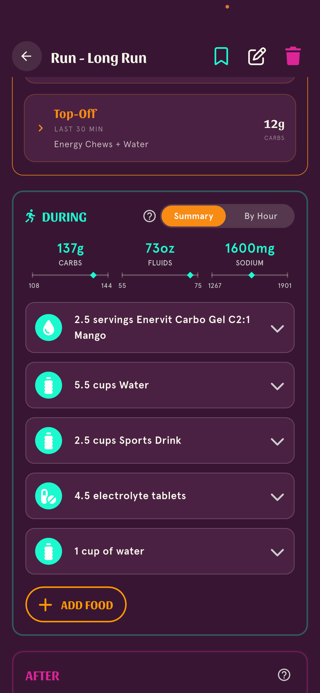

type: ruling-request
driver: functional / plan-generation
severity: Minor-to-Major (cosmetic in the list; a real double-count of fluid demand)
area: electrolyte/solvent-water pairing — app `lib/features/nutrition_plan/application/client_plan/electrolyte_water_pairing.dart` + its ratified twin `supabase/functions/_shared/nutrition/electrolyte-water-pairing.ts`; surfaced on the DURING fuel list (activity detail)
reporter: Xuan (self-discovered, 2026-09-15)
found: 2026-09-15 (prod App Store 1.26.0; also present on release/1.27.0)
screenshot: assets/2026-09-15-during-water-double-add/during-two-waters.png

# DURING phase shows water twice — a redundant electrolyte/solvent companion added on top of the main hydration water

## Symptom
On a long run's DURING fuel list, **water appears as two separate rows**:

- **"5.5 cups Water"** — the main hydration water.
- **"1 cup of water"** — a second, smaller water.

To the athlete this reads as a duplicate/bug ("why is water listed twice?").

## Definitive data (prod, activity dcf52ebe — "Run - Long Run", 2026-09-12)
Both rows are **plan-generated** (`isAdded=false`), different catalog foods:

| name | foodId | isDrink | fluids | plannedQty |
|---|---|---|---|---|
| Enervit Carbo Gel C2:1 Mango | 70029fdc… | no | 0 | 2.5 |
| **Water** | 0519e4ff… | yes | **1320 ml** | 5.5 |
| Sports Drink | af14e3c2… | yes | 600 ml | 2.5 |
| electrolyte tablet | 9fd63557… | no | 0 | 4.5 |
| **cup of water** | 408c9d6e… | yes | **240 ml** | 1 |

The second water is **240 ml ≈ `kDefaultPairingVolumeMl` (250)** — i.e. it is the
electrolyte/solvent **pairing companion**, appended by the "an electrolyte tablet /
concentrated gel is never recommended without water to take it with" invariant
(Lee 2026-07-29; solvent extension RULED Xuan 2026-09-03, catalog-conventions §6(e)).

## Why this looks like — and is — a defect
The 2026-09-03 ruling is explicit: **"solvent water IS hydration water — no double
demand"** (`electrolyte_water_pairing.dart` `plainWaterMl` doc). This phase already
carries **1320 ml plain Water + 600 ml Sports Drink** — far more than any tablet's or
gel's solvent need — so the dry electrolyte was already satisfied and the 240 ml
companion should **not** have been appended. Two passes (the solvent/pairing pass and
the hydration fill) appear to have demanded water independently instead of reconciling,
producing a redundant row and over-stating fluid demand by ~240 ml.

`needsWaterPairing` is supposed to prevent exactly this (any phase-level drinkable fluid
satisfies an undeclared dry item; declared solvent minima net against `plainWaterMl`).
So either (a) the passes ran in an order where the main Water wasn't yet present when the
pairing evaluated, or (b) the declared-solvent half double-counted. Needs tracing in the
**edge function twin** (this plan was server-generated → a fix there is a function
redeploy), kept in lock-step with the Dart mirror.

## Ratification asks
1. **Reconciliation rule.** When a phase already contains plain drinkable water ≥ the
   phase's solvent requirement, the pairing must add **no** companion — confirm this is
   the intended invariant and that "no double demand" governs the *final assembled* plan,
   not each pass in isolation. (If confirmed, the fix is to evaluate pairing against the
   fully-assembled phase, or to have the hydration fill satisfy/absorb the companion.)
2. **Merge vs. two rows.** Even when a small companion is legitimately needed, should the
   UI/plan **merge** it into the single Water row (one "Water: N cups" line) rather than
   show two water entries? This is a display-vs-data decision.
3. **Ordering guarantee.** Should the solvent/pairing pass be the LAST pass (after
   hydration fill) so it always sees the final fluid set? Document the pass order in the
   spec so the Dart and TS twins stay aligned.

## Out of scope
Not changing the "never a dry tablet/gel without water" invariant itself — only how it
reconciles with water already on the plate. No schema change.

## References
- `docs/ssot/spec/domain/catalog-conventions.md` §6(e) (solvent dependencies, RULED
  2026-09-03) — the "no double demand" clause this intake leans on.
- App mirror: `lib/features/nutrition_plan/application/client_plan/electrolyte_water_pairing.dart`
  (`needsWaterPairing`, `solventRequirementMl`, `plainWaterMl`, `ensureElectrolyteWaterPairing`).
- Edge twin: `supabase/functions/_shared/nutrition/electrolyte-water-pairing.ts`.
